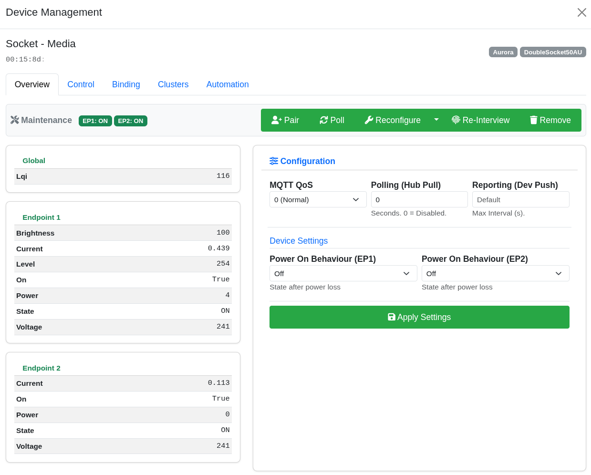
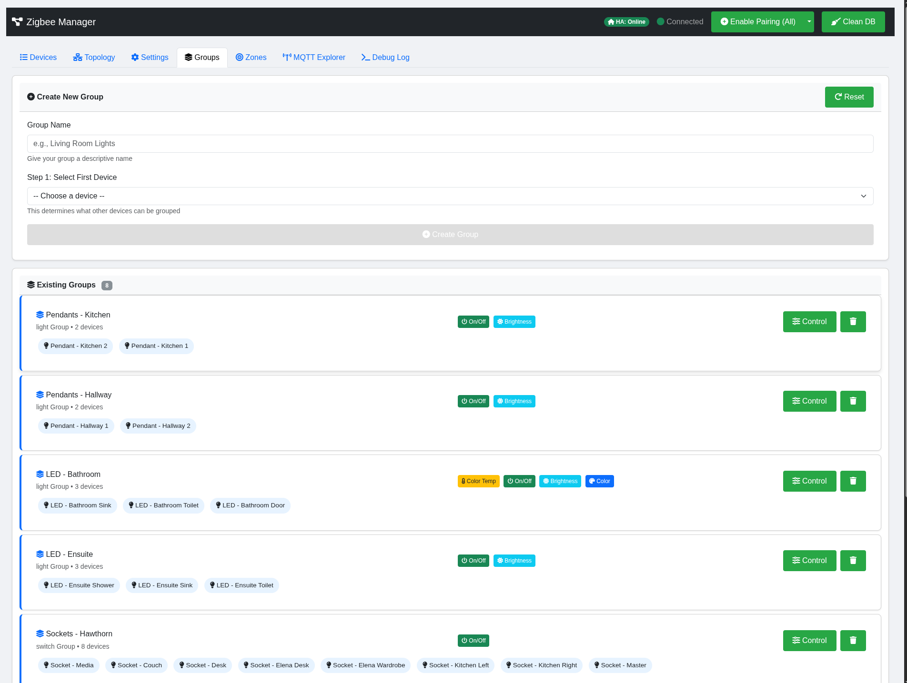
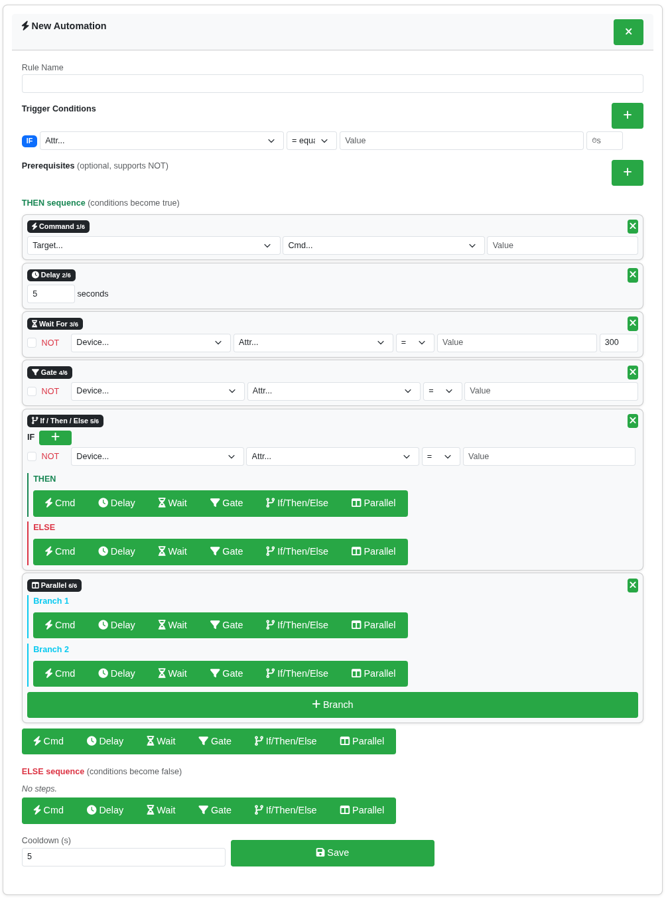
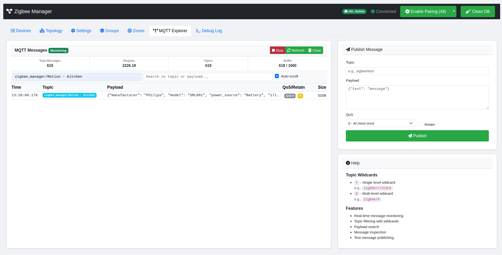
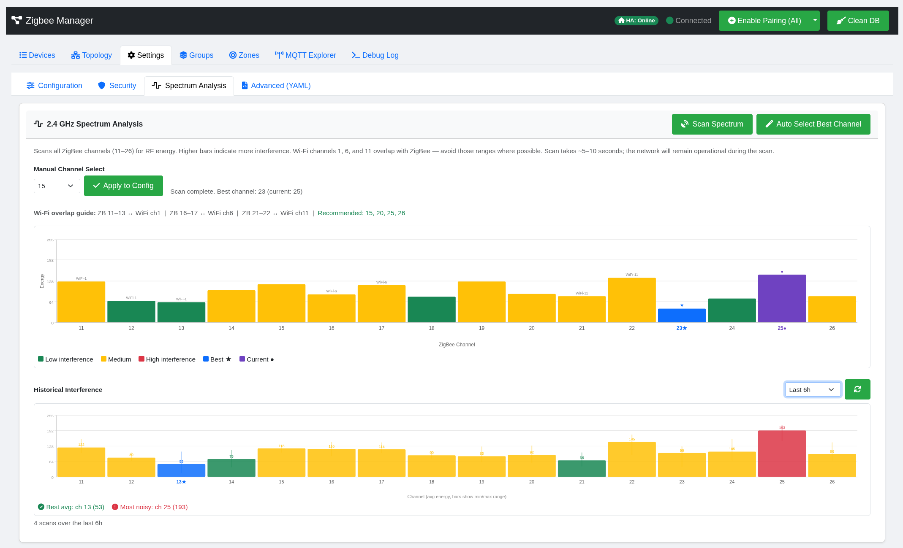

<p align="center">
  
</p>

<h1 align="center">ZigBee & Matter Manager</h1>

<p align="center">
  <strong>A Python-powered ZigBee & Matter gateway with real-time web UI and Home Assistant integration</strong>
</p>

<p align="center">
  
  
  
  
  
  
</p>

<p align="center">
  <a href="#-quick-start">Quick Start</a> · 
  <a href="#-features">Features</a> · 
  <a href="#-web-interface">Web Interface</a> · 
  <a href="#-automation-engine">Automations</a> · 
  <a href="#-configuration">Configuration</a> · 
  <a href="#-documentation">Docs</a>
</p>

---

<!-- SCREENSHOT: Full device table view -->
<p align="center">
  
  <br><em>Device management dashboard — real-time status, LQI, controls, and per-device automation</em>
</p>

## 📖 Overview

**ZigBee Manager** is a self-hosted gateway application that manages a Zigbee mesh network and bridges devices to **Home Assistant** via MQTT Discovery. It also supports **Matter** devices over WiFi (and Thread via OTBR), presenting a unified device list across both protocols. It has a modular Python backend built on [zigpy](https://github.com/zigpy/zigpy)/[bellows](https://github.com/zigpy/bellows) and [python-matter-server](https://github.com/home-assistant-libs/python-matter-server), with a real-time single-page web interface.

The system is designed for production-grade home automation — running 40+ devices on a Rock 5B with 30+ day uptime, featuring automatic NCP failure recovery, exponential backoff retries, and a fast-path pipeline for latency-critical sensor events.

---

## ⚡ Quick Start

```bash
# Clone the repository
git clone https://github.com/oneofthemany/ZigBee-Matter-Manager.git
cd ZigBee-Matter-Manager

# Run the automated deployment (sets up venv, systemd service, user)
sudo bash deploy.sh

# Start the service
sudo systemctl start zigbee-matter-manager
```

Open **http://YOUR_IP:8000** in your browser.

On first boot, if `channel`, `pan_id`, `extended_pan_id`, or `network_key` are absent or placeholder values, the system will **auto-generate valid random credentials** and write them to `config.yaml` before starting the radio. No manual YAML editing required for initial setup.

### Prerequisites

- Linux (Ubuntu/Debian recommended)
- Python 3.8+
- An MQTT broker (e.g. Mosquitto)
- A supported Zigbee coordinator (EZSP or ZNP USB stick)
- **Optional for Matter:** `python-matter-server[server]` pip package, IPv6-enabled network

---

## 🚀 Features

### Network Management & Device Control

- **Real-time Web Interface** — Single-page app with WebSocket-driven live updates, Bootstrap 5 UI
- **Device Lifecycle** — Join, rename, remove, re-interview, ban/unban devices
- **Remote Control** — On/Off, brightness, color temp, color XY/HS, cover position, thermostat setpoints
- **Multi-Endpoint Routing** — Proper handling of devices with multiple endpoints (e.g., dual-gang switches)
- **Device Tabs** — Custom tab organization to group devices by room or function (e.g., "Heating", "Lighting")
- **Touchlink** — Scan, identify (blink), and factory reset Philips Hue bulbs directly from the web UI

<!-- SCREENSHOT: Device modal with control tab -->
<p align="center">
  
  <br><em>Device modal — control panel, cluster browser, bindings, per-device configuration, and automation rules</em>
</p>

### Zigbee Groups

- **Native Zigbee Groups** — Create groups at the coordinator level (not just software grouping)
- **Smart Compatibility** — Input/output cluster awareness ensures only actuators are groupable; sensor-only devices are excluded
- **Unified Control** — On/off, brightness, color temp, color, and cover controls for groups
- **Home Assistant Discovery** — Groups appear as native HA entities via MQTT

<!-- SCREENSHOT: Groups tab -->
<p align="center">
  
  <br><em>Groups — compatible device detection, group creation, and unified control panel</em>
</p>

### Matter Integration (Optional)

Support for **Matter** devices alongside Zigbee — presented as a unified device list with protocol-aware routing.

- **Embedded Server** — Runs [python-matter-server](https://github.com/home-assistant-libs/python-matter-server) as a managed subprocess, no Docker required
- **WiFi Matter Devices** — Commission and control Matter-over-WiFi devices (Eve, Nanoleaf, etc.)
- **Unified Device List** — Matter and Zigbee devices appear in the same table with protocol badges
- **Cross-Protocol Automation** — Automation engine triggers and actions work across both protocols
- **MQTT Discovery** — Matter devices published to Home Assistant using the same discovery patterns
- **Zero Overhead** — Completely optional; disabled by default with no impact on Zigbee performance

For full documentation see [docs/matter.md](https://github.com/oneofthemany/ZigBee-Manager/blob/main/docs/matter.md).

### Automation Engine

A full state-machine automation system that executes directly at the Zigbee gateway level with **zero MQTT round-trip delay**.

- **State Machine Triggers** — Fire only on transitions (matched → unmatched), not on every matching update
- **Multi-Condition Rules** — Up to 5 AND conditions with sustain timers per source device
- **Prerequisites** — Check other device states before firing, with NOT negation
- **Recursive Action Sequences** — Command, Delay, Wait For, Gate, If/Then/Else branching, Parallel execution
- **Group Targets** — Command steps can target Zigbee groups as well as individual devices
- **Trace Log** — Real-time colour-coded evaluation history for debugging automation behaviour
- **JSON Export** — Download/import rules for backup or sharing

<!-- SCREENSHOT: Automation rule builder -->
<p align="center">
  
  <br><em>Automation rule builder — IF/AND conditions, CHECK prerequisites, THEN/ELSE action sequences</em>
</p>

For full documentation see [docs/automations.md](https://github.com/oneofthemany/ZigBee-Manager/blob/main/docs/automations.md).

### MQTT Explorer

An integrated MQTT debugging tool — monitor all broker traffic in real-time without leaving the gateway.

- **Live Traffic Monitor** — Subscribe to `#` wildcard with topic and payload filtering
- **Publish Tool** — Send test messages to any topic with configurable QoS
- **Wildcard Support** — `+` single-level and `#` multi-level pattern matching
- **Three-Level Debugging** — Correlate packet capture → debug log → MQTT output

<!-- SCREENSHOT: MQTT Explorer -->
<p align="center">
  
  <br><em>MQTT Explorer — real-time message stream, topic filtering, and publish tool</em>
</p>

For full documentation see [docs/mqtt-explorer.md](https://github.com/oneofthemany/ZigBee-Manager/blob/main/docs/mqtt-explorer.md).

### Zone-Based Presence Detection

An experimental presence detection system using RSSI signal fluctuations from existing Zigbee devices — no dedicated presence sensors required.

- **RSSI Baseline Calibration** — Learns normal signal patterns per device link
- **Fluctuation Detection** — Triggers occupancy when multiple links show deviation
- **MQTT Publishing** — Zones appear as binary sensors in Home Assistant
- **Configurable Thresholds** — Deviation sensitivity, minimum triggered links, clear delay

<!-- SCREENSHOT: Zones tab -->
<p align="center">
  
  <br><em>Zone presence detection — RSSI-based occupancy without dedicated sensors</em>
</p>

### Stability & Resilience

- **NCP Failure Recovery** — Automatic watchdog with recovery logic for critical coordinator failures
- **EZSP Dynamic Tuning** — Coordinator stack settings auto-tuned based on network size (packet buffers, APS counts, source route tables)
- **Fast Path Processing** — Non-blocking pipeline for motion/presence sensors to minimise MQTT publication latency
- **MQTT Queue** — Background publish queue prevents event loop stalls during bursts
- **Exponential Backoff** — Automatic retry with configurable backoff for transient command failures
- **Multi-Radio Support** — Auto-detection of EZSP and ZNP coordinators

### Diagnostics & Debugging

- **Live Debug Log** — Real-time filtered log streaming to the browser
- **Packet Capture** — Raw ZCL frame capture with human-readable decoding
- **Deep Packet Analysis** — IAS Zone (0x0500), Occupancy (0x0406), and Tuya (0xEF00) protocol decoders
- **Mesh Topology** — Interactive D3.js force-directed graph with LQI link quality overlay

<!-- SCREENSHOT: Mesh topology -->
<p align="center">
  
  <br><em>Mesh topology — force-directed graph showing device relationships and link quality</em>
</p>

### Home Assistant Integration

- **MQTT Discovery** — All devices and groups auto-discovered with proper schemas (JSON, not legacy template)
- **Full Component Support** — light, switch, cover, climate, sensor, binary_sensor, number
- **Birth Message Handling** — Automatic republish on HA restart
- **Device Metadata** — Manufacturer, model, SW version passed through to HA device registry

### Supported Devices & Quirk Handling

Tested with 40+ devices across multiple manufacturers:

| Manufacturer       | Devices                            | Notes                                              |
|:-------------------|:-----------------------------------|:---------------------------------------------------|
| **Philips Hue**    | Lights, Motion Sensors             | Touchlink reset, binding-based `on_with_timed_off` |
| **IKEA Tradfri**   | Bulbs, Remotes                     | Standard ZCL                                       |
| **Aqara / Xiaomi** | Switches, TRV E1, Buttons, Sensors | Full 0xFCC0 manufacturer cluster support           |
| **Tuya**           | Radar Sensors, Blinds, Switches    | DP (Data Point) mapping via 0xEF00                 |
| **Hive**           | Smart Heating (SLR, TRV)           | Thermostat cluster with scheduling                 |
| **Aurora**         | Smart Sockets                      | Power monitoring                                   |
| **Sonoff**         | Contact Sensors, Switches          | With quirk handling                                |
| **Matter (WiFi)**  | Any Matter-certified WiFi device   | Via python-matter-server                           |

**Cluster Handlers:** Basic (0x0000), Power (0x0001), On/Off (0x0006), Level (0x0008), Thermostat (0x0201), Color (0x0300), Window Covering (0x0102), Temperature, Humidity, Illuminance, Occupancy, IAS Zone (0x0500), Metering (0x0702), Electrical Measurement (0x0B04), Aqara (0xFCC0), Tuya (0xEF00).

---

## 🌐 Web Interface

Access at **http://YOUR_IP:8000**. All tabs update in real-time via WebSocket.

| Tab               | Description                                                                                                                                                  |
|:------------------|:-------------------------------------------------------------------------------------------------------------------------------------------------------------|
| **Devices**       | Main device table — LQI, status, last seen, controls. Click any device for a full modal with control, bindings, clusters, configuration, and automation tabs |
| **Topology**      | Interactive force-directed mesh graph with LQI link quality                                                                                                  |
| **Groups**        | Create and control native Zigbee groups                                                                                                                      |
| **Zones**         | RSSI-based presence detection zones                                                                                                                          |
| **MQTT Explorer** | Real-time MQTT traffic monitor and publish tool                                                                                                              |
| **Settings**      | Rich settings panel — see below                                                                                                                              |
| **Debug Log**     | Live filtered log stream and raw packet analyser                                                                                                             |

### Settings Panel

The settings tab is a four-sub-tab panel replacing the old single YAML textarea:

| Sub-tab               | Description                                                                                                                                                                                      |
|:----------------------|:-------------------------------------------------------------------------------------------------------------------------------------------------------------------------------------------------|
| **Configuration**     | Form-based editor for Zigbee radio, MQTT broker, web interface, and logging settings. Writes to `config.yaml` with no manual YAML editing required. Includes HTTPS/SSL toggle.                   |
| **Security**          | Manage PAN ID, Extended PAN ID, and Network Key with per-field regenerate buttons. Network key is hidden by default.                                                                             |
| **Spectrum Analysis** | Live 2.4 GHz energy scan across all ZigBee channels (11–26) with colour-coded interference chart. Auto channel select writes the best channel to config. Manual channel override also available. |
| **Advanced (YAML)**   | Raw `config.yaml` editor — preserved for advanced users who need direct access.                                                                                                                  |

<!-- SCREENSHOT: Settings panel -->
<p align="center">
  
  <br><em>Settings panel — structured form UI, security credential management, and spectrum analysis</em>
</p>

<!-- SCREENSHOT: Spectrum Analysis -->
<p align="center">
  
  <br><em>Settings panel —  spectrum analysis</em>
</p>

### Device Modal

Each device opens a tabbed modal with:

| Tab            | What it does                                                                                                                            |
|:---------------|:----------------------------------------------------------------------------------------------------------------------------------------|
| **Overview**   | Identity, maintenance actions (re-interview, poll, remove, ban), sensor readings, device-specific configuration (Aqara modes, Tuya DPs) |
| **Control**    | Send commands — on/off, brightness sliders, color picker, thermostat setpoints, cover position                                          |
| **Bindings**   | View and manage ZCL bindings between devices                                                                                            |
| **Clusters**   | Raw cluster browser — read attributes, explore endpoints                                                                                |
| **Automation** | Per-device rule builder for the automation engine                                                                                       |

---

## 🏗️ Architecture

| Component               | Technology                                  | Role                                                               |
|:------------------------|:--------------------------------------------|:-------------------------------------------------------------------|
| **Core**                | Python (FastAPI, zigpy/bellows)              | Zigbee radio, device lifecycle, resilience, state management       |
| **Matter Server**       | python-matter-server (managed subprocess)    | CHIP SDK controller for Matter devices (optional)                  |
| **Matter Bridge**       | aiohttp WebSocket client                     | Translates Matter nodes into unified device format                 |
| **MQTT Service**        | aiomqtt                                      | Broker connection, reconnection, HA MQTT Discovery                 |
| **Cluster Handlers**    | handlers/ package                            | ZCL message decoding, normalised state, device-specific logic      |
| **Automation Engine**   | modules/automation.py                        | State-machine rules, recursive sequences, direct zigpy execution   |
| **Group Manager**       | modules/groups.py                            | Native Zigbee groups with input/output cluster awareness           |
| **Network Init**        | modules/network_init.py                      | Auto-generation of credentials and channel selection on first boot |
| **Frontend**            | HTML, Bootstrap 5, D3.js                     | SPA connected via WebSocket for real-time updates                  |

For the full file structure see [docs/structure.md](https://github.com/oneofthemany/ZigBee-Manager/blob/main/docs/structure.md).

---

## ⚙️ Configuration

Configuration is managed through the **Settings tab** in the web UI, which provides a structured form interface backed by `config.yaml`. Direct file editing is also available via the Advanced sub-tab or on disk.

```bash
sudo vi /opt/zigbee_matter_manager/config/config.yaml
```

### First Boot — Auto-Generated Credentials

On startup, if any of the following values are absent or contain placeholder text, the system auto-generates secure random values and writes them to `config.yaml` before the radio starts:

| Value                    | Auto-generated as                          |
|:-------------------------|:-------------------------------------------|
| `zigbee.pan_id`          | Random 16-bit hex (e.g. `A3F1`)            |
| `zigbee.extended_pan_id` | Random 8-byte array                        |
| `zigbee.network_key`     | Random 128-bit key (16-byte array)         |
| `zigbee.channel`         | Channel 15 (overridable via spectrum scan) |

### Key Config Sections

| Section              | What to configure                                                  |
|:---------------------|:-------------------------------------------------------------------|
| `mqtt`               | `broker_host`, `username`, `password` — match your MQTT broker     |
| `zigbee.port`        | USB stick path, e.g. `/dev/ttyACM0`                                |
| `zigbee.channel`     | Zigbee channel — use Spectrum Analysis tab to find the best option |
| `zigbee.pan_id`      | Network PAN ID — auto-generated on first boot                      |
| `zigbee.network_key` | 128-bit network encryption key — auto-generated on first boot      |
| `zigbee.ezsp_config` | Advanced coordinator tuning — pre-configured for large networks    |
| `matter`             | Optional Matter integration — see [docs/matter.md](https://github.com/oneofthemany/ZigBee-Manager/blob/main/docs/matter.md) |

### Matter Configuration

```yaml
# Optional — disabled by default, zero overhead when disabled
matter:
  enabled: true                    # Start embedded server
  port: 5580                       # WebSocket port
  storage_path: ./data/matter      # Fabric/node persistence
```

See [docs/matter.md](https://github.com/oneofthemany/ZigBee-Manager/blob/main/docs/matter.md) for full setup instructions including prerequisites, commissioning, and troubleshooting.

### Spectrum Analysis & Channel Selection

The **Spectrum Analysis** tab performs a live energy scan via the coordinator across all 16 ZigBee channels (11–26). Results are displayed as a colour-coded bar chart showing RF noise floor per channel, with Wi-Fi 1/6/11 overlap zones annotated.

- **Auto Select** — scans all channels and writes the lowest-interference channel to config automatically
- **Manual Select** — pick any channel from the dropdown and apply to config
- Recommended channels avoiding typical Wi-Fi overlap: **15, 20, 25, 26**

---

## 📚 Documentation

| Document                                                                                                            | Content                                                                          |
|:--------------------------------------------------------------------------------------------------------------------|:---------------------------------------------------------------------------------|
| [docs/automations.md](https://github.com/oneofthemany/ZigBee-Manager/blob/main/docs/automations.md)                 | Automation engine — rule builder, step types, state machine, trace log, examples |
| [docs/mqtt-explorer.md](https://github.com/oneofthemany/ZigBee-Manager/blob/main/docs/mqtt-explorer.md)             | MQTT Explorer — usage guide, wildcard patterns, debugging workflows              |
| [docs/matter.md](https://github.com/oneofthemany/ZigBee-Manager/blob/main/docs/matter.md)                           | Matter integration — setup, commissioning, architecture, troubleshooting         |
| [docs/onboarding.md](https://github.com/oneofthemany/ZigBee-Manager/blob/main/docs/onboarding.md)                   | Adding support for new/unsupported devices                                       |
| [docs/debugging.md](https://github.com/oneofthemany/ZigBee-Manager/blob/main/docs/debugging.md)                     | Built-in debugger, packet capture, filters, log files                            |
| [docs/aqara_cluster_guide.md](https://github.com/oneofthemany/ZigBee-Manager/blob/main/docs/aqara_cluster_guide.md) | Aqara manufacturer cluster (0xFCC0) implementation                               |
| [docs/structure.md](https://github.com/oneofthemany/ZigBee-Manager/blob/main/docs/structure.md)                     | Complete file structure map                                                      |

---

## 🐛 Debugging & Troubleshooting

### Built-in Tools

1. **Live Logs** — Real-time WebSocket log stream with category filtering
2. **Debug Packets Modal** — Raw ZCL frame capture with decoded summaries
3. **MQTT Explorer** — Monitor all MQTT traffic, publish test messages
4. **Trace Log** — Automation evaluation history with colour-coded results
5. **Mesh Topology** — Visual network graph with LQI overlay
6. **Spectrum Analysis** — Identify channel interference causing network instability

### Log Files

| File                    | Content                                             |
|:------------------------|:----------------------------------------------------|
| `logs/zigbee.log`       | Main application log                                |
| `logs/zigbee_debug.log` | Detailed packet/handler events (when debug enabled) |

### Service Commands

```bash
sudo systemctl status zigbee-matter-manager             # Check service status
sudo systemctl kill -s SIGKILL zigbee-matter-manager    # Kill the service
sudo systemctl start zigbee-matter-manager              # Start the service
sudo journalctl -u zigbee-matter-manager -f             # Follow system logs
sudo tail -f /opt/zigbee_matter_manager/logs/zigbee.log        # Follow app logs
```

---

## 🤝 Contributing

Contributions are welcome. The codebase follows a modular handler architecture — adding support for a new device typically means adding or extending a cluster handler in `handlers/`. See [docs/onboarding.md](https://github.com/oneofthemany/ZigBee-Manager/blob/main/docs/onboarding.md) for a step-by-step guide.

---

## 📄 License

This project is open source. See [LICENSE](LICENSE) for details.