<p align="center">
  
</p>

<h1 align="center">ZigBee &amp; Matter Manager</h1>

<p align="center">
  <strong>A self-hosted home hub — Zigbee &amp; Matter gateway, heating brain, media system, energy and drive tracker, DNS ad-blocker, all behind one real-time web UI</strong>
</p>

<p align="center">
  
  
  
  
  
  
  
  
  
</p>

<p align="center">
  <a href="#-quick-start">Quick Start</a> ·
  <a href="#-the-gateway">Gateway</a> ·
  <a href="#-the-house">The House</a> ·
  <a href="#-the-platform">Platform</a> ·
  <a href="#-zmm-manager-the-sidecar">ZMM Manager</a> ·
  <a href="#-web-interface">Web Interface</a> ·
  <a href="#-configuration">Configuration</a> ·
  <a href="#-roadmap">Roadmap</a> ·
  <a href="#-troubleshooting">Troubleshooting</a> ·
  <a href="#-documentation">Docs</a>
</p>

---

<p align="center">
  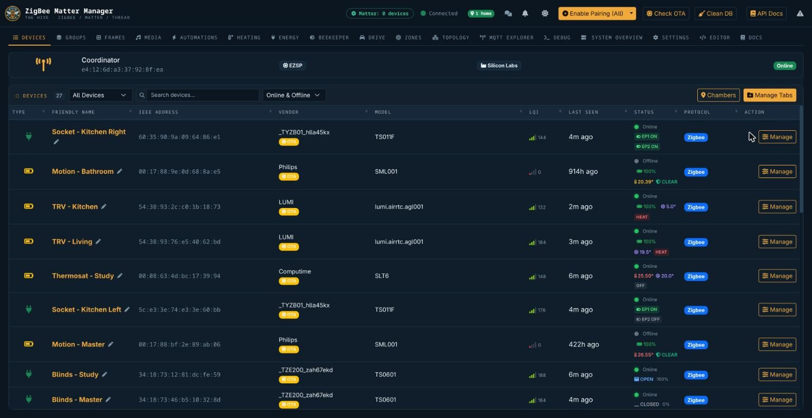
  <br><em>Device management dashboard — real-time status, LQI, OTA badges, protocol indicators, chambers and per-device controls</em>
</p>

## 📖 Overview

**ZigBee Matter Manager** (ZMM) began as a Zigbee gateway. It still is one — [zigpy](https://github.com/zigpy/zigpy)/[bellows](https://github.com/zigpy/bellows) drives the radio, [python-matter-server](https://github.com/home-assistant-libs/python-matter-server) drives Matter over WiFi and Thread, and everything is published to **Home Assistant** over MQTT Discovery. But the gateway is now the *floor* of the project rather than the whole of it.

Around that core the app has grown into the hub for the house:

- it **runs the heating** — thermal modelling, per-room control, solar gain, radiator sizing;
- it **watches the energy** — Octopus smart-meter consumption, tariffs and live demand;
- it **plays the music** — multi-room Cast/AirPlay/Sonos sync with its own clock discipline, server-side EQ and neural TTS;
- it **blocks the ads** — a network-wide DNS sinkhole running as an always-on sidecar;
- it **tracks the driving** — trips, driving style, driver attribution and cheapest-fuel lookups, with an Android companion app and an Android Auto screen;
- it **knows who's home** — per-user presence from phones, shared geofenced places, and RSSI-based room occupancy from the mesh itself;
- it **is its own admin surface** — users, groups, scoped tokens, TOTP MFA, Cloudflare-tunnel remote access, an in-app code editor with test-and-rollback, in-app upgrades, and a bundled wiki.

Everything runs on one Python event loop, with a DuckDB time-series store underneath and a single-page web UI on top. The design target is a production household: automatic NCP failure recovery, exponential backoff, a fast-path pipeline for latency-critical sensor events, and a watchdog that would rather restart than wedge.

The deployment is **two processes, deliberately**. The app serves the house on `:8000`. A second, much smaller **[ZMM Manager](#-zmm-manager-the-sidecar)** sidecar serves `:8001` and does nothing but watch, recover and upgrade the app — so the surface you need when the app is broken is never part of the app that broke.

**Current release:** `v29.02.08.2026`

---

## ⚡ Quick Start

### Podman Container

The installer runs **entirely as root** — rootful podman is required for the
Zigbee USB coordinator, OTBR network namespaces and the host systemd units.
Pipe into `sudo bash` (not `sudo curl`): with `sudo curl … | bash` only *curl*
is elevated and the `bash` reading the pipe stays unprivileged, which fails when
it tries to create `/opt/.zigbee-matter-manager`.

```bash
# curl bash automated install
curl -fsSL https://raw.githubusercontent.com/oneofthemany/ZigBee-Matter-Manager/main/build.sh | sudo bash

# if you know the device
curl -fsSL https://raw.githubusercontent.com/oneofthemany/ZigBee-Matter-Manager/main/build.sh | sudo bash -s -- --usb /dev/ttyUSB0

# large/enterprise networks — bake the Rust telemetry appender into the image
# (adds ~3–5 min to the build for the Rust toolchain + maturin compile)
curl -fsSL https://raw.githubusercontent.com/oneofthemany/ZigBee-Matter-Manager/main/build.sh | sudo bash -s -- --with-appender --usb /dev/ttyUSB0
```

**Note**: You may see the following during boot — DO NOT PANIC, THIS IS INTENTIONAL
```
+ echo ' *** WARNING: systemctl not found. otbr cannot start on boot.'
  *** WARNING: systemctl not found. otbr cannot start on boot.
+ . /dev/null
```
Also be aware that the compile time will take about 15-25 mins depending on the device you are installing it on, as there is a lot going on — go have a cup of something 😃

### Python VENV — soon to be deprecated
```bash
# Clone the repository
git clone https://github.com/oneofthemany/ZigBee-Matter-Manager/tree/venv.git
cd ZigBee-Matter-Manager

# Run the automated deployment (sets up venv, systemd service, user)
sudo bash deploy.sh

# Start the service
sudo systemctl start zigbee-matter-manager
```

Open **http://YOUR_IP:8000** in your browser (or **https://** once you enable SSL in Settings). The **[ZMM Manager](#-zmm-manager-the-sidecar)** sidecar comes up alongside it on **`:8001`**, and stays reachable even when the app is not.

On first boot, if `channel`, `pan_id`, `extended_pan_id`, or `network_key` are absent or placeholder values, the system will **auto-generate valid random credentials** and write them to `config.yaml` before starting the radio. No manual YAML editing required for initial setup.

The first install also sets up the **in-app upgrade watcher** (a small host-side systemd unit) so future updates can be installed from the **Settings → Upgrade** tab without re-running `build.sh`. See [In-App Upgrades](#-in-app-upgrades) for the full flow.

### Prerequisites

- Linux with Podman (preferred) or Docker, plus `root` access — the installer runs entirely as root (rootful podman is required for USB coordinator access, OTBR network namespaces and the host systemd units)
- Python 3.8+
- An MQTT broker (e.g. Mosquitto) — for Home Assistant support
- A supported Zigbee coordinator (auto-detected on first boot). Recognised families:
  - **EZSP / EmberZNet** (Silicon Labs EFR32) — e.g. **Nabu Casa Home Assistant Connect ZBT-2**, **Nabu Casa SkyConnect**, Sonoff Zigbee Dongle Plus-E, Elelabs, Nortek HUSBZB-1, CP210x-based sticks
  - **ZNP / Z-Stack** (Texas Instruments CC2531 / CC2538 / CC2652, Electrolama zzh)
  - **deCONZ** (Dresden Elektronik ConBee II / III, RaspBee)
- **Optional for Matter:** `python-matter-server[server]` pip package, IPv6-enabled network
- **Optional for multi-speaker sync:** a microphone (USB or built-in) for the chirp-based Cast speaker-sync calibration — passed through automatically via `/dev/snd`
- **Optional for a local LLM:** the AI settings tab assesses the host and will tell you honestly whether one is viable (see [AI Assistant](#-ai-assistant--local-llm))

---

## 🔌 The Gateway

The Zigbee/Matter half of the app — radios, devices, groups, firmware and rules.

### Network Management & Device Control

- **Real-time Web Interface** — Single-page app with WebSocket-driven live updates, Bootstrap 5 UI, light/dark themes and a PWA manifest
- **Device Lifecycle** — Join, rename, remove, re-interview, ban/unban devices, with live join/interview progress
- **Remote Control** — On/Off, brightness, colour temp, colour XY/HS, cover position, thermostat setpoints
- **Multi-Endpoint Routing** — Proper handling of devices with multiple endpoints (e.g. dual-gang switches)
- **Chambers & Device Tabs** — Group devices into rooms ("chambers") and custom tabs, which also drive the Frames dashboards
- **Touchlink** — Scan, identify (blink), and factory reset Philips Hue bulbs directly from the web UI
- **Backup & Restore** — One-click zip of config, device DB, automations, groups and zones — everything needed to rebuild the network on a new container

### Device Profiles

A protocol-agnostic JSON description of a device model that covers **Zigbee and Matter with one schema**. Supersedes — and stays backwards-compatible with — the older split of `device_overrides.py` (Zigbee attribute renaming) and `matter_definitions.py`.

- **Discover / Signals / Assemble** — a three-step workflow in the device modal's Profile tab: watch what the device actually emits, map the signals you recognise, then assemble a reusable profile
- **Universal signal capture** — the Signal Inspector records every raw `(source, address, value)` a device emits, with no device-class knowledge, so unknown hardware is mappable rather than opaque
- **Model-level promotion** — map once, promote to the model, and every device of that type inherits it
- **Manufacturer-aware** — known clusters (Aqara `0xFCC0`, Tuya `0xEF00`, Philips `0xFC00`, IKEA `0xFC7C`) get intelligent prefixing and manufacturer-code handling
- **Rotary bindings** — Matter rotary dial positions mapped to proportional commands on target devices (an 18-position dial driving brightness 0–254)

<p align="center">
  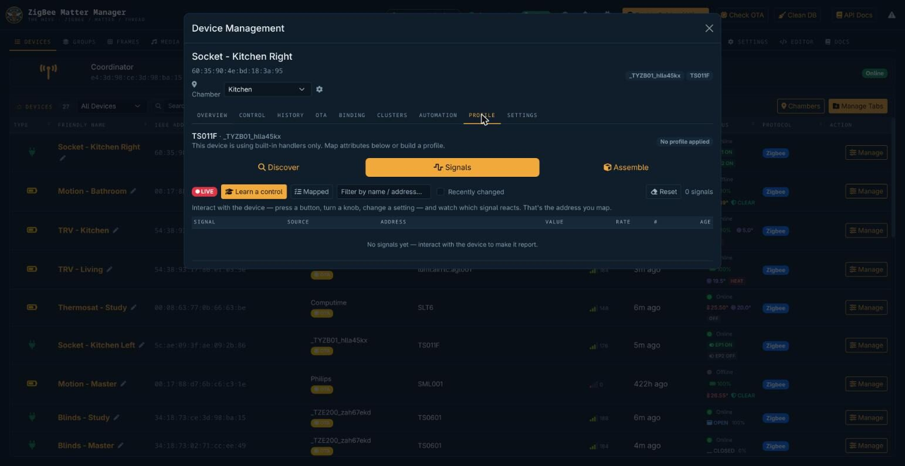
  <br><em>Device Profiles — live signal capture, attribute mapping, and profile assembly without a code change or restart</em>
</p>

See **[docs/device-profiles.md](docs/device-profiles.md)** and **[docs/onboarding_unsupported_devices.md](docs/onboarding_unsupported_devices.md)**.

### Zigbee Groups

- **Native Zigbee Groups** — Created at the coordinator level, not just software grouping
- **Smart Compatibility** — Input/output cluster awareness ensures only actuators are groupable; sensor-only devices are excluded
- **Unified Control** — On/off, brightness, colour temp, colour and cover controls for groups
- **Home Assistant Discovery** — Groups appear as native HA entities via MQTT

<p align="center">
  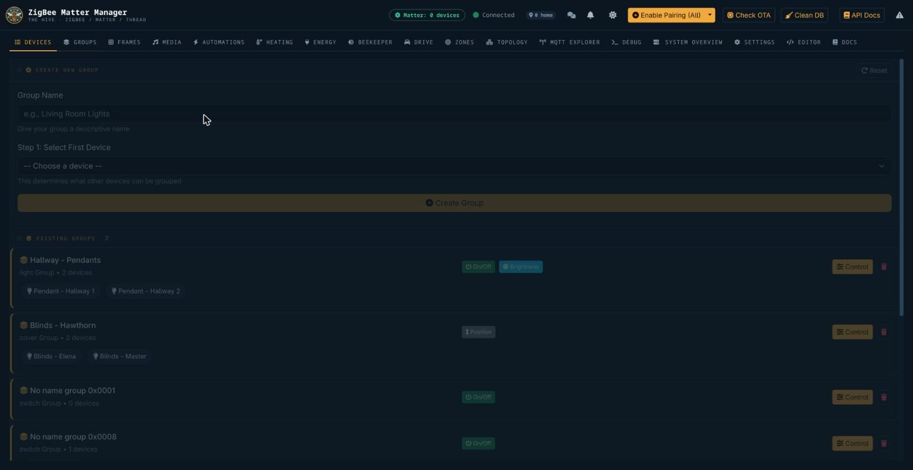
  <br><em>Groups — compatible device detection, group creation, and unified control</em>
</p>

### Matter Integration (Optional)

Full **Matter** support alongside Zigbee — devices from both protocols appear in a single unified device list with protocol badges, and all the same features (automations, MQTT Discovery, OTA where applicable, WebSocket updates, control modals) work identically across both.

**How it works internally.** The application spawns [python-matter-server](https://github.com/home-assistant-libs/python-matter-server) as a managed Python subprocess — no Docker, no separate service. A `MatterBridge` module connects to its WebSocket API on `localhost:5580`, translates Matter nodes into the same internal device format as Zigbee devices, and feeds them through the same event pipeline. `handlers/matter_parsers.py` decodes Matter cluster attributes into the same normalised state shape the Zigbee side produces, so the frontend, automation engine and MQTT publishing code don't need to know which protocol a device speaks.

**Two transport options:**

- **Matter-over-WiFi** — Commission any WiFi-based Matter device (Eve, Nanoleaf, Aqara Hub M3 accessories, TP-Link Tapo Matter, etc.) using the 11-digit setup code or the QR numeric pairing code.
- **Matter-over-Thread** — Uses the Sonoff MG24 dongle in **MultiPAN RCP** mode, which runs Zigbee *and* Thread simultaneously on the same radio. An embedded OpenThread Border Router (`otbr-agent`) provides the Thread network, and devices like Thread TRVs (IKEA BILRESA, Eve Thermo) commission onto it the same way.

- **Unified device list** — Matter and Zigbee in the same table with protocol badges
- **Cross-protocol automations** — a Zigbee motion sensor can turn on a Matter lamp and vice versa
- **Zero overhead when disabled** — if `matter.enabled` is false, no Matter code runs at all
- **Auto-restart on crash** — health monitoring with exponential backoff (up to 5 retries)

See **[docs/matter.md](docs/matter.md)** for the full reference, and **[docs/multipan.md](docs/multipan.md)** for the dual-protocol radio.

### MultiPAN (Zigbee + Thread on one radio)

The **Sonoff Zigbee Dongle Plus-E (MG24)** running MultiPAN RCP firmware serves both the Zigbee mesh and the Thread network concurrently — halving your USB port requirement for Matter-over-Thread households.

- **Single radio, two protocols** — MG24 acts as a Zigbee NCP for zigpy/bellows *and* as a Radio Co-Processor for OpenThread, multiplexed over one serial link using CPC/HDLC framing
- **Rust framing module** — `modules/tdm/zmm_cpc/` (PyO3/maturin) implements the CPC/HDLC wire format (`FLAG EP LEN_LO LEN_HI CTRL HCS(2)`, CRC-16/XMODEM)
- **In-process PTY bridge** — `modules/pty_bridge.py` replaces `socat` with an asyncio PTY↔TCP relay: no external binary, per-frame logging, lifecycle tied to the MultiPAN manager
- **Embedded OpenThread Border Router** — `otbr-agent` runs inside the container, bound to the MG24 via D-Bus
- **Dongle Jedi setup wizard** — guided first-boot flow that detects the dongle, confirms firmware, forms or joins a Thread network, and writes the dataset into `config.yaml`
- **Link-state handshake recovery** — stale CPC I-frames from a previous boot are drained and acknowledged before SABM, preventing the "dongle unresponsive after restart" failure

### OTA Firmware Updates

- **Multi-Provider Support** — Automatic image matching via IKEA, LEDVANCE, Sonoff, Inovelli and other zigpy OTA providers
- **Per-Device Check & Update** — From the device modal's OTA tab, with live WebSocket progress
- **Bulk Scan** — One-click "Check OTA" across every device
- **Local Firmware Upload** — `.ota`, `.zigbee`, `.bin`, `.ota1`, `.sbl-ota` for devices no provider covers
- **Background Checks** — Periodic automatic scans (every 6 hours) with notification when updates are found
- **Image Notify** — Prompt sleepy devices to check for updates
- **OTA Badge** — Devices with the OTA cluster are flagged in the device table

### Automation Engine

A full state-machine automation system that executes directly at the gateway with **zero MQTT round-trip delay**.

- **State Machine Triggers** — Fire only on transitions (matched → unmatched), not on every matching update
- **Multi-Condition Rules** — Up to 5 AND conditions with sustain timers per source device
- **Prerequisites** — Check other device states before firing, with NOT negation and OR logic across time windows
- **Recursive Action Sequences** — Command, Delay, Wait For, Gate, If/Then/Else branching, Parallel execution
- **Group and user targets** — Command steps can target Zigbee groups; presence users are virtual devices, so "when Sean arrives at Office" is an ordinary rule
- **Day-of-Week Filtering** and a **30-second time-boundary scheduler** so rules fire on exact times, not only on device changes
- **Trace Log** — Real-time colour-coded evaluation history
- **JSON Export** — Download/import rules for backup or sharing

<p align="center">
  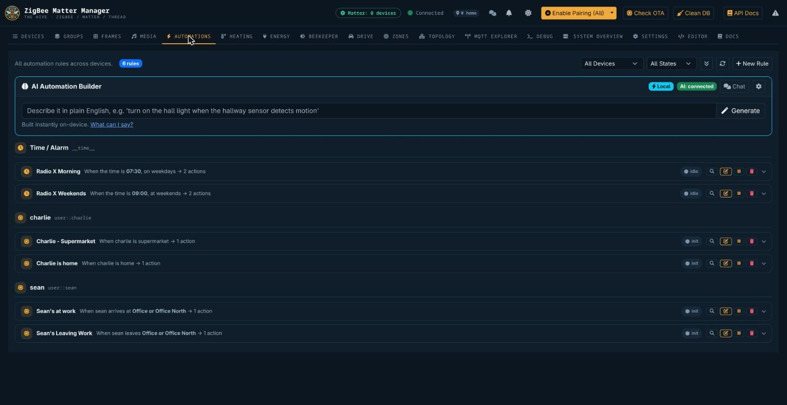
  <br><em>Automations — the AI builder on top, rules grouped by trigger source, each with state, trace and inline edit</em>
</p>

For full documentation see **[docs/automations.md](docs/automations.md)**.

---

## 🏠 The House

Everything the hub does that isn't strictly a radio protocol.

### 🔥 Weather-Aware Heating

A heating system with a thermal model underneath it, not just a schedule.

- **Heating Advisor** — read-only analytical engine. Produces an EPC-style rating, per-room thermal profiles (W/K heat loss) and pre-heat timing. Correlates outdoor weather with indoor temperatures and demand to surface efficiency tips (over-heating, mild-weather shutoff, cold-snap pre-heat, insulation/glazing upgrades, heat-pump candidacy, tariff optimisation).
- **Heating Controller** — active control. Classifies each room `cold` / `ontarget` / `hot` with hysteresis (±0.3–0.5 °C), calls the boiler receiver only when a room is actually cold, and coordinates per-TRV setpoints so a hot room can't steal heat from a cold one on the same circuit. External-sensor modes (`advisory` / `push`) work around TRV hot-pipe bias, including writing external temperatures into the Aqara `0xFCC0` cluster.
- **Thermal Profile** — per-room heat loss in W/K, computed statically (SAP Appendix S U-values from dimensions and insulation) *and* measurably (Newton's law of cooling fitted to telemetry cool-down windows), then blended by fit quality.
- **Radiator Sizing** — MCS-style required watts at design outdoor temperature (−3 °C), derated to your actual flow temperature with the manufacturer exponent 1.3. Flags each radiator `undersized` / `adequate` / `oversized`.
- **Solar Gain** — instantaneous watts per room from window geometry and real-time sun position (ASHRAE simplified approach with a diffuse term), plus an averaged pre-heat window and hourly forecast.
- **Floor Plan editor** — draw the home, and the plan projects back into the legacy per-room `dimensions` blocks. `heating.circuits` in `config.yaml` stays the source of truth.
- **Anomaly Watcher** — scans every 5 minutes for rooms cooling faster than their baseline `τ`, catching open windows, broken seals and stuck TRVs without anyone watching graphs.
- **Dry-run mode** — runs the full decision tick and logs what it *would* do without commanding anything. Safe way to validate a new circuit/room config.

<p align="center">
  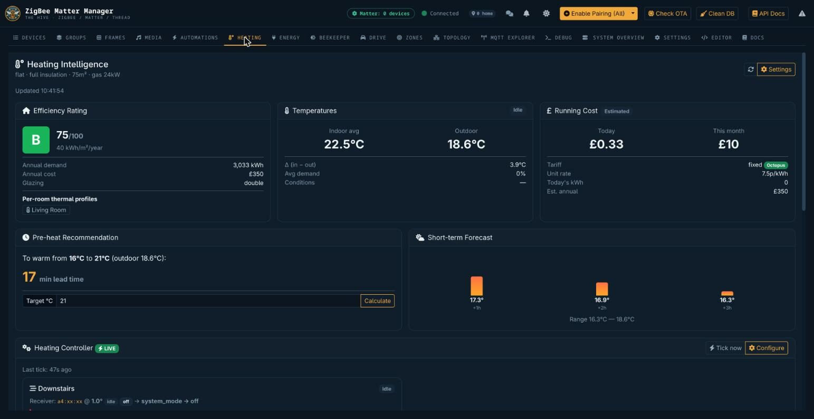
  <br><em>Heating Intelligence — EPC-style rating, indoor/outdoor delta, live running cost against the Octopus tariff, and pre-heat lead time</em>
</p>

<p align="center">
  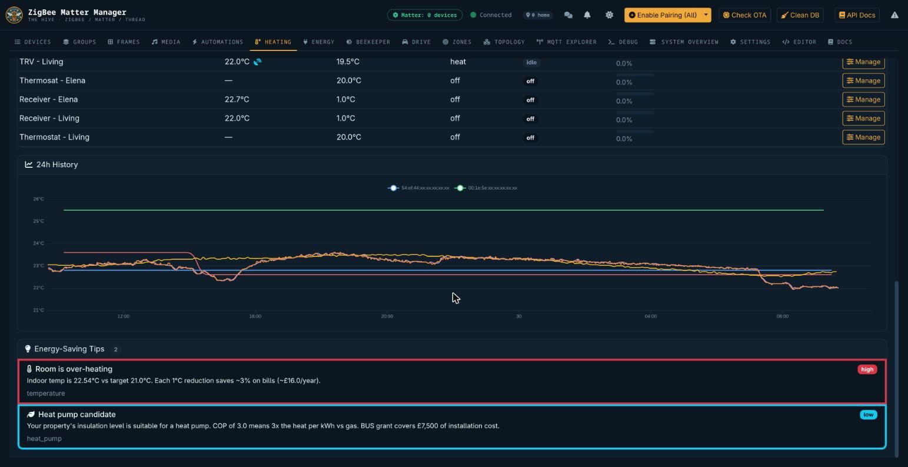
  <br><em>Per-TRV state, 24h temperature history, and rule-based efficiency tips with the money attached</em>
</p>

See **[docs/heating.md](docs/heating.md)** for the physics, config schema, tip triggers and hysteresis constants.

### ⚡ Energy — Octopus

Smart-meter consumption and tariffs from the Octopus Energy API, with optional near-real-time demand from a Home Mini.

- **Consumption** — electricity and gas, half-hourly, charted by day or month
- **Tariffs** — unit rates and standing charges, including half-hourly **Agile** pricing and tomorrow's rates when published
- **Live demand** — a Home Mini gives a watts-now reading sampled every 5 minutes
- **Feeds the heating** — the advisor's running-cost and tariff-optimisation tips read the real tariff, and `heating_tariff()` returns `None` on any doubt, so a bad rate can never break heating

<p align="center">
  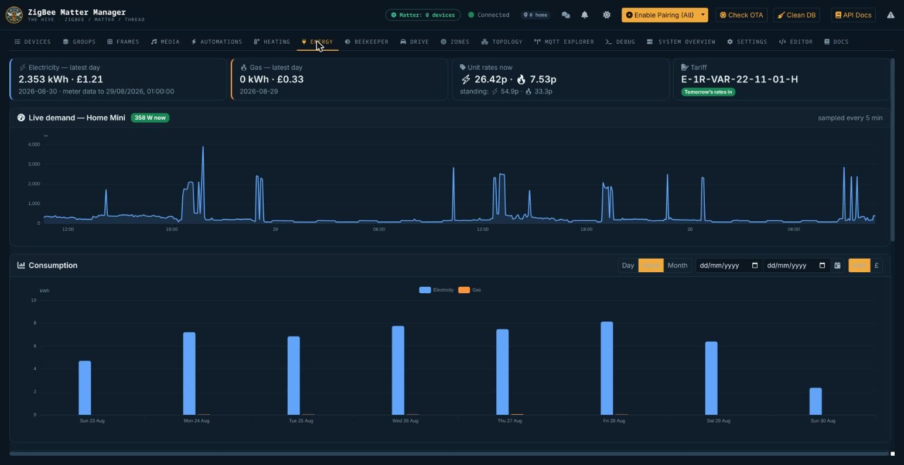
  <br><em>Energy — latest-day electricity and gas, live demand from the Home Mini, and daily consumption against the active tariff</em>
</p>

See **[docs/energy.md](docs/energy.md)**.

### 🎵 Media, OpenZone & Therapy

Multi-room audio with the sync problem solved in the source, not the vendor's app.

- **OpenZone** — synchronised multi-speaker casting across **Google Cast, AirPlay/RAOP, Sonos/UPnP and generic HTTP renderers**, using groups defined in ZMM rather than the Google Home app. Target accuracy is ±2 ms between any two devices, achieved with source-side clock discipline and no vendor grouping mechanism.
- **Chirp calibration** — a recorded test tone measures each speaker's real latency through a microphone, so the offsets are measured rather than guessed.
- **Server-side EQ** — Cast targets expose no DSP API, so ffmpeg decodes to PCM, the `zmm_eq` Rust biquad chain filters it, and the result is served as an endless WAV. Slider changes swap coefficients atomically on the live stream, so a band is audible in under a second with no restart.
- **Sources** — internet radio, Tidal, local files, and anything else ffmpeg can open.
- **Therapy soundscapes** — a server-side synth port of the SPA's Web Audio graph to numpy, served as an endless WAV through the same play path, paced to real time so players buffer seconds rather than minutes.
- **Neural TTS** — Kokoro-82M via `kokoro-onnx`, running in-process, with speed as a native model parameter rather than a time-stretch. The ~340 MB model downloads on demand rather than bloating the image.

<p align="center">
  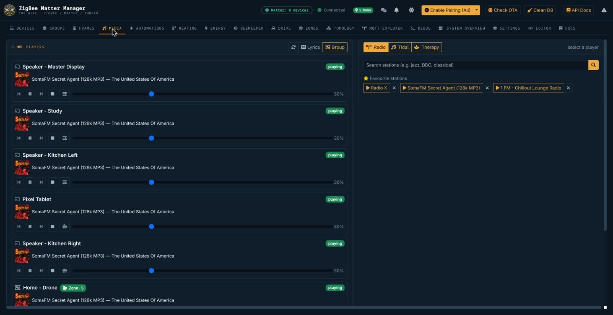
  <br><em>Media — every player in the zone on the same stream, per-player volume and EQ, with radio/Tidal/therapy sources on the right</em>
</p>

See **[docs/speaker_sync.md](docs/speaker_sync.md)** and **[docs/open-zone.md](docs/open-zone.md)** (the clock-discipline write-up).

### 🖼 Frames

Dynamically-generated dashboards, laid out from device chamber and device type — the "put a tablet on the wall" view.

- Frames are **filters over the live hive**, never stored device state, so they cannot go stale
- Lay out **by chamber** (room) or **by device type**
- Saved frames live in `data/frames.json`; a standalone `frames.html` is served for kiosk displays

<p align="center">
  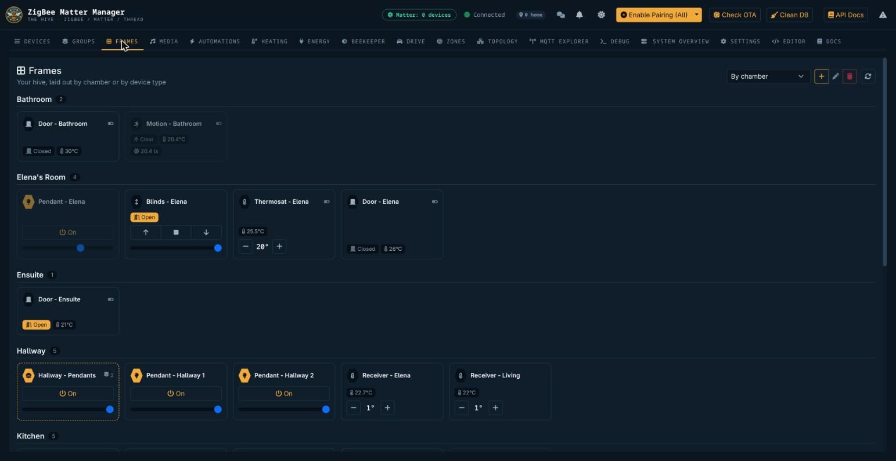
  <br><em>Frames — the hive laid out by room, with the right control for each device type inline</em>
</p>

See **[docs/frames.md](docs/frames.md)**.

### 🚗 Drive — Journeys & Fuel

Drive tracking fed by the Android companion app's drive mode, plus cheapest-fuel lookups.

- **Trips** — while the phone is connected to the car's Bluetooth, fixes stream tagged with a `trip_id`, GPS speed and bearing; `modules/journeys.py` segments them into trips and computes distance, duration, average and top speed
- **Driving behaviour** — a style score from the phone's inertial summaries, with harsh brake/accel/corner counts and peak g
- **Driver attribution** — hub-side attribution today; car Bluetooth address and Android Auto signals are the agreed next tier
- **Cheapest fuel nearby** — station, price per litre, distance and a maps link, cheapest first, around home or any searched location
- **Price history** — every query is snapshotted, because neither UK source publishes an archive

<p align="center">
  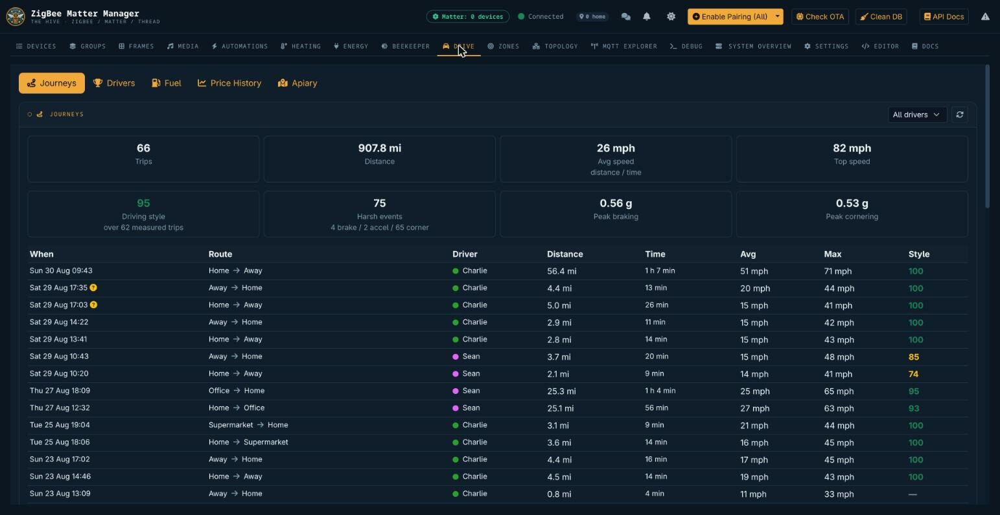
  <br><em>Journeys — trip totals, driving-style score and harsh-event breakdown, with per-trip route, driver and speeds</em>
</p>

<p align="center">
  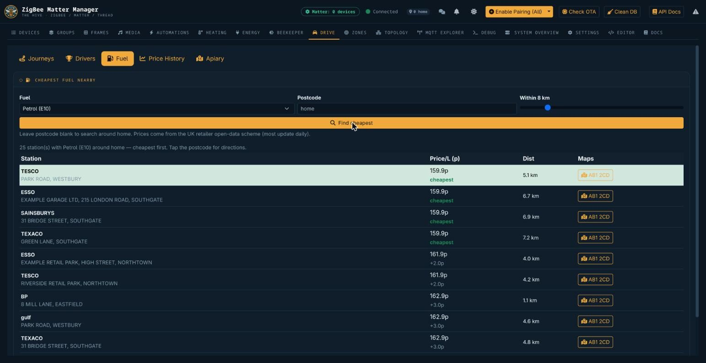
  <br><em>Cheapest fuel nearby — grade, radius and location, cheapest first with the delta against the best price</em>
</p>

> Station names, addresses and postcodes in this screenshot are placeholders.

Fuel is **UK-only today**; making the region a setting is in progress — see **[Roadmap](#-roadmap)**. Full reference: **[docs/journeys.md](docs/journeys.md)**.

### 🐝 Beekeeper — DNS Ad & Tracker Blocking

A network-wide DNS sinkhole (Pi-hole/AdGuard-style, but its own engine — no third-party DNS library) that blocks ads and trackers for every device on the LAN.

- Runs as a **decoupled always-on sidecar**, so restarting or upgrading ZMM never drops household DNS
- Per-client query logs, top blocked domains, top clients, and a 24h allowed-vs-blocked chart
- Live domain testing, pause controls, and a blocklist of ~135k domains
- The app talks to it over a loopback control API and degrades to an offline state rather than erroring when the sidecar isn't reachable

<p align="center">
  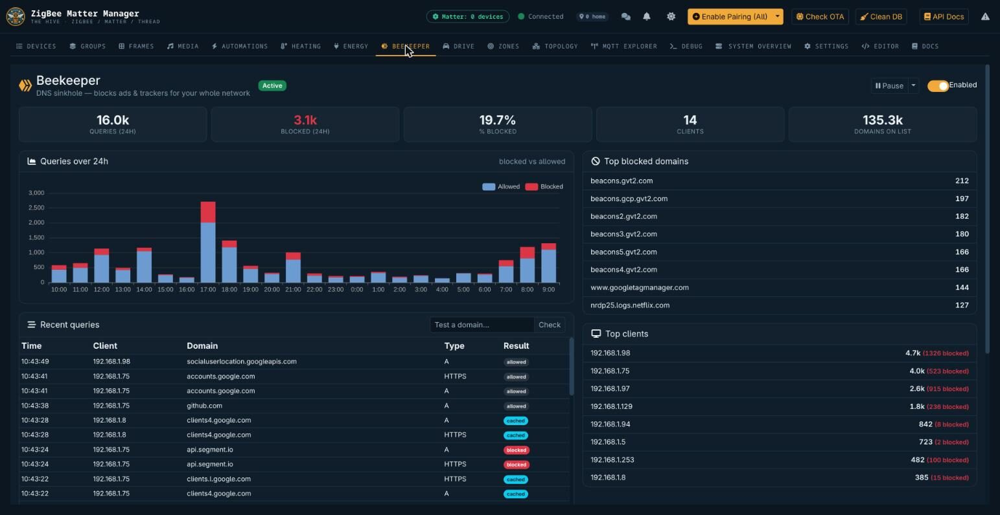
  <br><em>Beekeeper — 24h query volume and block rate, live query log, top blocked domains and per-client totals</em>
</p>

See **[docs/beekeeper.md](docs/beekeeper.md)**.

### 👥 Presence — People, Places & Zones

Three independent mechanisms, deliberately not merged:

- **Per-user presence** from the Android companion app. Each user becomes a **virtual device** (presence, `distance_m`, `accuracy_m`, source, `last_update`) merged into the automation engine's registry, so rules, AI automations and MQTT discovery work on people unmodified. Live coordinates stay in memory and are never persisted.
- **Places** — shared geofences beyond home. Home belongs to each user, but a place means the same coordinates for everyone, so places live in one registry. Resolution is **server-side**: the phone's geofence only wakes the OS, and the fix it posts is resolved on the hub — so adding a place or changing a radius needs no app update.
- **Zones** — RSSI-based room occupancy from the existing mesh, no dedicated sensors. Learns a per-link baseline, triggers when several links deviate together, and publishes each zone as an HA binary sensor.

Place search is local-first against a per-country postal dataset on the hub, so lookups are instant, work offline, and the typed string never leaves the house. Map tiles are proxied and cached, so the tile server sees the hub once per tile rather than every viewer on every pan.

See **[docs/presence_detection.md](docs/presence_detection.md)** and **[docs/place-search.md](docs/place-search.md)**.

### 🔒 Physical Security & Climate

- **Smart locks** — Nuki over the LAN bridge HTTP API (hashed-token auth by default, since the plain form leaks the token to anything watching LAN traffic), plus bridge-less Nuki locks over Matter. Providers come from a registry so the Security tab builds itself.
- **Air conditioning** — local-LAN control of **Gree**-protocol units (EcoAir and clones) and **Midea**-protocol units (Comfee and clones), spoken directly on the LAN with no Home Assistant bridge. Both libraries are optional; the module reports "library not installed" rather than breaking the app.

See **[docs/security.md](docs/security.md)** and **[docs/air-conditioning.md](docs/air-conditioning.md)**.

### 🔔 Notifications, Messages & Web Push

- **Application Alert Center** — `raise_alert()` for concrete, actionable problems, plus a log handler that turns any `ERROR` into a deduplicated alert, so failures surface in the UI instead of dying in a log file
- **Messages** — person-to-person threads inside ZMM, with history and unread counts, delivered over the WebSocket. A conversation belongs to its two participants and the API never lets a third user read it, admins included. Automations send through the same store, so a rule's message joins the thread.
- **Web Push** — RFC 8291 payload encryption and RFC 8292 VAPID signing, implemented over `cryptography` rather than pywebpush, so a notification lands on a phone that isn't open and the vendor relay only ever carries ciphertext

See **[docs/notifications.md](docs/notifications.md)**.

---

## 🛠 The Platform

The parts that make the hub administrable, observable and upgradeable.

### 🧠 AI Assistant & Local LLM

AI is **optional and honest about itself**. The deterministic path is tried first and handles most real requests with no model at all.

- **Local NL parser first** — `modules/nl_automations.py` is a dependency-free compiler from constrained English to the rule dict the automation engine consumes. No LLM, no network call: a parse is microseconds of pure-Python string work, and every device, attribute and value is grounded against the live registry rather than guessed.
- **LLM as fallback** — only when the deterministic parse fails does `POST /api/ai/automation` hand off to the model, which builds a device-aware system prompt from the live registry and returns a rule ready for `add_rule()` or form pre-fill.
- **Domain-aware chat** — deliberately not a generic chatbot. The system prompt is rebuilt from the registry every turn, so it can explain device state, diagnose why a rule did or did not fire, and suggest rules in the app's own vocabulary.
- **Provider abstraction** — OpenAI, Ollama, Anthropic, or any OpenAI-compatible endpoint, selected by the `ai:` block.
- **Host capability assessor** — inspects CPU, RAM and GPU and decides whether a local LLM is viable *here*, which model sizes fit and which backend makes sense. It measures and recommends; it never installs or runs anything on its own. On a small SBC the honest answer is usually "stick with the local parser", and it says so.
- **Managed local backends** — `OllamaManager` runs Ollama as a sibling container over the host runtime's Docker-compatible REST API (ZMM's own image carries no podman/docker CLI); `SGLangManager` mirrors it for GPU hosts and refuses to install without NVIDIA CDI passthrough. Every privileged action is user-triggered and gated on the assessor.

<p align="center">
  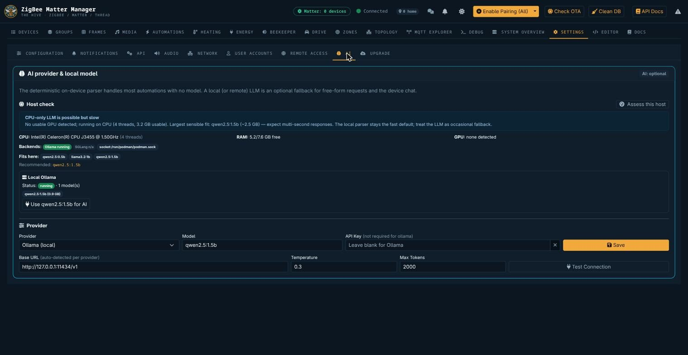
  <br><em>AI settings — the host check states plainly what this machine can run, which models fit, and what it recommends before you commit to anything</em>
</p>

### 👤 Users, Groups, Tokens & MFA

A built-in identity system so the gateway can be shared between household members and used by mobile apps without exposing the whole API.

- **Users, groups and scopes** — with **bearer tokens hashed at rest and shown once**. Deliberately no OAuth/OIDC/JWT: static tokens until revoked.
- **Scoped per-device tokens** — a phone gets `presence:read:<user>` and `presence:write:<user>` and nothing else. It cannot read another user's location, list the household, or touch a single device. Revoke per-phone.
- **MFA** — TOTP (RFC 6238) on stdlib `hmac`/`hashlib` alone, single-use recovery codes hashed at rest, per-account exponential lockout, a per-IP sliding-window limiter, and a constant-ish login delay to mask "user exists" timing
- **LAN-only accounts** — a `network:lan_only` scope, backed by source-IP resolution that trusts forwarding headers **only** from a configured trusted-proxy peer, since otherwise they are trivially spoofed
- **Remote access** — a managed **Cloudflare Tunnel** run as a supervised `cloudflared` subprocess, so no port forwarding is needed; the tunnel dials out. Token mode for permanent use (token passed via env, never argv) and quick mode for testing. Starting the tunnel flips the live network resolver so remote clients aren't misclassified as LAN.

See **[docs/auth.md](docs/auth.md)**, **[docs/security.md](docs/security.md)** and **[docs/remote_access.md](docs/remote_access.md)**.

### 📊 Telemetry Database

History lives in **DuckDB** files under `data/` — chosen over SQLite for columnar aggregation, ZSTD compression, non-blocking reads and time-bucket functions.

- System metrics, packet stats, device states and spectrum scans, each with its own retention
- Octopus, host metrics, geocoding and messages live in separate files
- A fatal-state latch, backend reconciliation and rebuild paths mean damage is detected and repaired **without you doing anything**
- An optional **Rust appender** (`--with-appender` at build time) for large networks

<p align="center">
  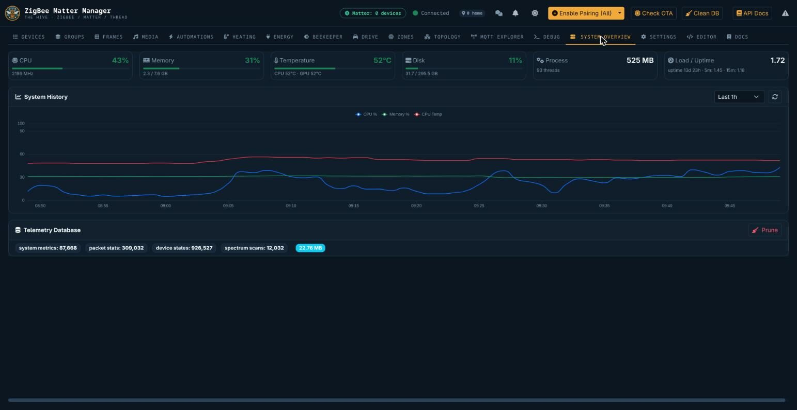
  <br><em>System Overview — host vitals, 1h history, and the telemetry store's row counts and on-disk size with a prune control</em>
</p>

See **[docs/telemetry_database.md](docs/telemetry_database.md)**.

### 📝 In-App Editor, Test & Recovery

An editor for the running container, with the safety rails that makes necessary.

- **Browse and edit** the whole project tree in-app, with search and automatic backups on every save
- **Test & recovery** — single-file and multi-file batches; every file in a batch shares one backup group and **rolls back together**, which is required when edits span dependent files
- **Survives restarts** — pending state persists to disk and is consumed by `boot_guard.py` on a failed boot, so a bad edit self-reverts rather than bricking the hub
- **Safe deploy** — backup, validate, restart, health-check, rollback. The health check cannot run in the process being restarted, so a deploy marker hands the job to the new one, which restores and restarts again on failure.
- **Live-edit detection** — in-container edits aren't in git and aren't carried into a new image, so the Upgrade tab **warns before an upgrade would silently discard them**, and offers to export them as a zip

<p align="center">
  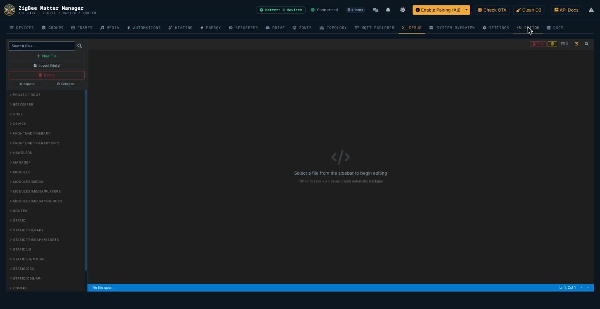
  <br><em>Editor — the running project tree, with per-save backups and batch test-and-rollback behind it</em>
</p>

### 🔄 In-App Upgrades

Upgrade from the web UI — no SSH, no `build.sh` re-run. The system pulls a tagged release from GitHub, builds a new container image in the background while the current app keeps running, then atomic-swaps when you choose. If the new container fails to start or fails health-check, it rolls back automatically.

- **Blue-green deployment** — new image builds in parallel; only the final swap causes a brief (~15 s) interruption
- **Atomic swap with auto-rollback** — health-check-gated; if the new container doesn't respond at `/api/status` within 60 s, the previous container is restored
- **One-click manual rollback** — the previous container and image are retained after every successful upgrade, and rollback to *any* retained version is driven from the [ZMM Manager](#-zmm-manager-the-sidecar), so it works with the app down
- **GitHub tag polling** — background check every 6 hours with a toast when a release appears; manual "Check now" too
- **Configurable auto-update** — off by default; when enabled, updates install only inside a quiet window (default 03:00–05:00) so the hub never restarts mid heating cycle or mid pairing
- **Multi-arch aware** — images are tagged per architecture (`…:29.02.08.2026-arm64` vs `-amd64`) and the right one is picked automatically
- **Stable / pre-release channel**, **image retention policy**, and **build log streaming** in the UI
- **Cross-distro watcher** — `systemd-path` units where available (event-driven, no CPU when idle) with a polling fallback; scripts live under `/opt/zmm/` so SELinux's `init_t → usr_t` policy lets systemd execute them without relabelling
- **Host OS updates** — Settings also surfaces pending *host* package updates and OS release upgrades (`dnf` on Fedora/RHEL, `apt` on Debian/Ubuntu) and can apply them. Fedora release upgrades target the **latest** available release and finish via the offline-transaction reboot. Image-based hosts (Silverblue / IoT) stage `rpm-ostree` deployments instead.
- **Python dependencies and Rust components** get their own sub-tabs, so the optional native pieces can be built or rebuilt after the fact

**How it works internally.** The container is fully unprivileged and never touches the host's container runtime directly. The app writes a small JSON trigger file to a shared volume; a host-side `systemd-path` unit detects it and runs `/opt/zmm/upgrade.sh`, which clones the target tag, builds the image, performs the stop/rename/run sequence, and writes status back to a file the app polls. No podman socket mounting, no privileged containers, no cross-runtime API differences.

<p align="center">
  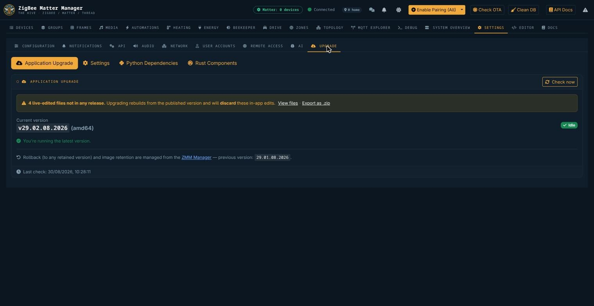
  <br><em>Upgrade — current version and channel, the live-edit warning before anything is discarded, and the retained previous version for rollback</em>
</p>

For an existing install that pre-dates the upgrade infrastructure:

```bash
curl -fsSL https://raw.githubusercontent.com/oneofthemany/ZigBee-Matter-Manager/main/scripts/install_watcher.sh | sudo bash
```

See **[docs/upgrades.md](docs/upgrades.md)**.

### 🔍 Diagnostics & Debugging

- **Live Debug Log** — real-time filtered log streaming to the browser, filterable by level and by IEEE address, downloadable
- **Signal Inspector** — universal, device-agnostic capture of every raw signal a device emits, by tapping the three choke points everything converges on, with no device-class knowledge and no raising into the handler path
- **Packet Capture & Deep Analysis** — raw ZCL frames with human-readable decoding, including IAS Zone (`0x0500`), Occupancy (`0x0406`) and Tuya (`0xEF00`) decoders with DP decoding
- **Packet Flow** — in-memory packet-rate tracking that runs whether or not full capture is on: rates, sparkline, hourly stats, chattiness rankings and EWMA-baseline anomaly detection. Pure stdlib, no DB writes, no locks.
- **Mesh Topology** — force-directed graph plus a connection table with per-device role and neighbour counts, and a packet-statistics view
- **Spectrum Analysis** — live 2.4 GHz energy scan across channels 11–26, with a background scanner storing history in DuckDB for interference correlation
- **MQTT Explorer** — subscribe to `#` with topic and payload filtering, plus a publish tool, to correlate packet capture → debug log → MQTT output
- **API Explorer** — the FastAPI route table as HTML, JSON and an interactive explorer at `/api-docs`

<p align="center">
  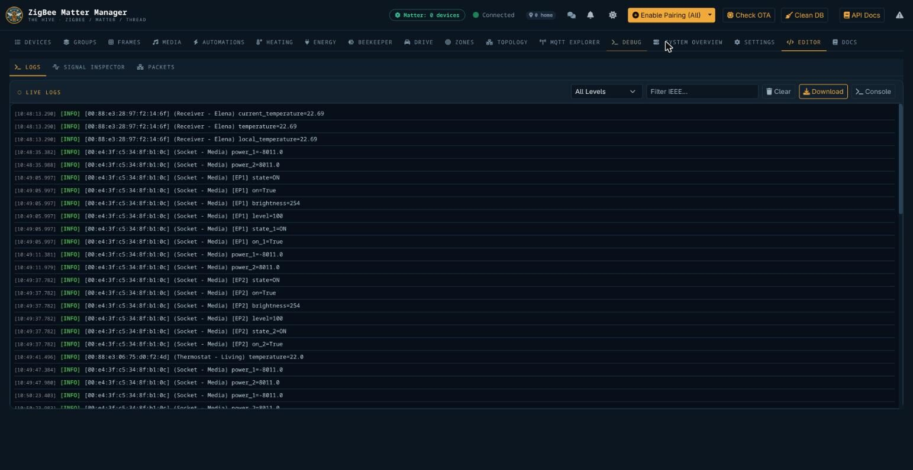
  <br><em>Live logs — every decoded attribute report as it lands, filterable by level and address</em>
</p>

<p align="center">
  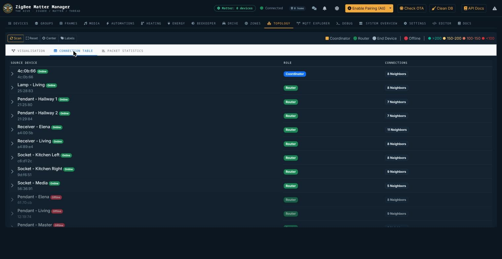
  <br><em>Topology — per-device role and neighbour count from the mesh scan, expandable to per-link LQI</em>
</p>

<p align="center">
  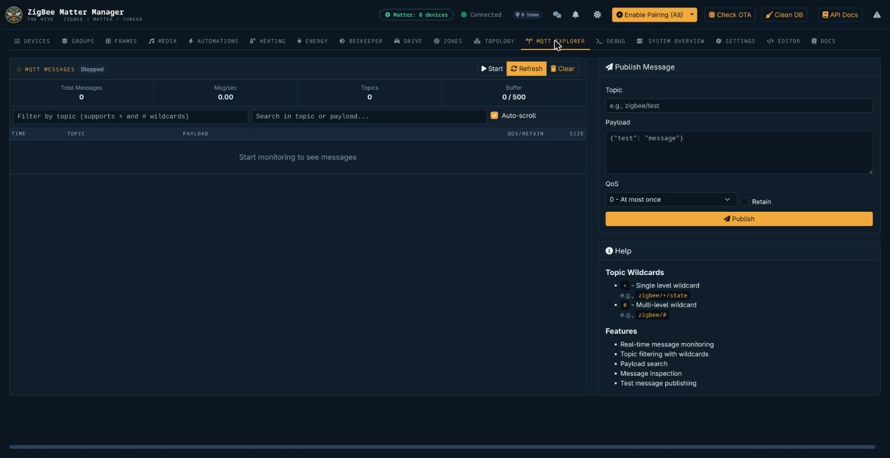
  <br><em>MQTT Explorer — live broker traffic with wildcard filtering, and a publish tool for test messages</em>
</p>

See **[docs/debugging.md](docs/debugging.md)**.

### Stability & Resilience

- **NCP Failure Recovery** — watchdog with recovery logic for critical coordinator failures
- **EZSP Dynamic Tuning** — stack settings auto-tuned to network size (packet buffers, APS counts, source route tables)
- **Fast Path Processing** — non-blocking pipeline for motion/presence sensors to minimise MQTT latency
- **MQTT Queue** — background publish queue prevents event-loop stalls during bursts
- **Exponential Backoff** — configurable retry for transient command failures
- **Boot Guard** — consumes pending edit state on a failed boot and reverts
- **Orphaned Device Cleanup** — detect and remove stale database entries

### 🏡 Home Assistant Integration

- **MQTT Discovery** — all devices and groups auto-discovered with proper schemas (JSON, not legacy template)
- **Full Component Support** — light, switch, cover, climate, sensor, binary_sensor, number
- **Birth Message Handling** — automatic republish on HA restart
- **Device Metadata** — manufacturer, model, SW version passed to the HA device registry
- **Delta-Only Publishing** — only changed attributes are published, to avoid false HA automation triggers

### 📱 Android Companion App

A minimal, self-hosted presence app in `android/`. It talks to **your hub only** — no accounts, no third-party service, no analytics.

| Channel | When it reports | Battery cost |
|---|---|---|
| **Geofence** | crossing your home or place boundaries | ~none (OS-delivered, app can be dead) |
| **Heartbeat** | every 15–60 min (set per user on the hub) | one brief fix per interval |
| **Passive** | when you've moved ≥50 m *and* some app already computed a location | ~none (piggybacks) |
| **Drive mode** | every minute while connected to your car's Bluetooth | ~none in practice (phone charging, GPS already on) |

The phone holds a **scoped bearer token**, not your password. Transport is HTTPS with certificate pinning decided once at pairing: ordinary CA validation behind a tunnel with a real certificate, or a confirmed fingerprint pin for a self-signed hub on the LAN. Neither mode trusts the phone's user CA store. An explicit `http://` URL is **refused at pairing**.

It also ships an **Android Auto** screen for the cheapest-fuel lookup. See **[android/README.md](android/README.md)**.

---

## 🐝 ZMM Manager (the sidecar)

The deployment is two processes on purpose. The app serves the house on **`:8000`**. **ZMM Manager** is a second, much smaller FastAPI service on **`:8001`** whose entire job is to watch, recover and upgrade the app — so **the surface you need when the app is broken is never part of the app that broke**.

It replaces an older in-container `recovery_server.py`, which had the obvious flaw: it could only run while the app was alive, which is exactly when you don't need it.

**How it is wired**

- A second member of the `zmm` pod, **sharing the host network namespace**, so it reaches the app at `127.0.0.1:8000`
- **Mounts the container-runtime socket**, so it can inspect and manage the pod's containers over podman/docker's Docker-compatible REST API
- **Never imports from `modules/`.** It is the disaster-recovery surface, so it stays standalone; the pieces duplicated from the app (the Ollama container create-config, for instance) are duplicated *by convention* and kept in sync deliberately
- **Matches the app's scheme.** If the app's self-signed cert exists in the mounted data dir it serves HTTPS, so it is reachable at the same scheme as the app — which also satisfies the HSTS that `https://…:8000` imposes on the whole host. No cert, and it falls back to plain HTTP
- It stays up while the app restarts, upgrades, rolls back or crashes

<p align="center">
  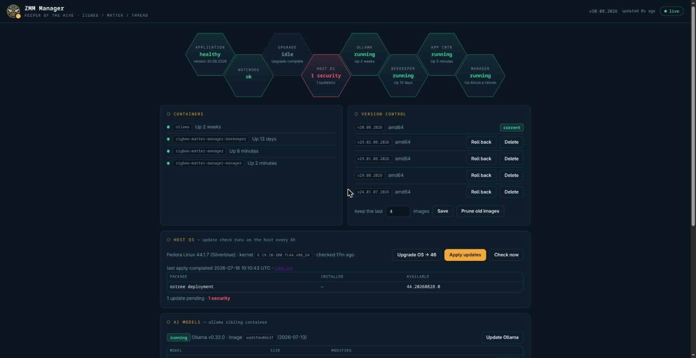
  <br><em>The status honeycomb, containers and version control. Captured live during a real event: the upgrade to v30.08.2026 failed its health check, the manager rolled the app back to v29.02.08.2026 on its own, and the application hexagon is green again.</em>
</p>

**What it does**

| Panel | Capability |
|:---|:---|
| **Status honeycomb** | Application health, watchdog state, upgrade state, host OS updates, and per-container status at a glance |
| **Watchdog** | An asyncio task that auto-recovers the app *and* Ollama when unhealthy — conservative by design: startup grace, slow escalation, a restart cap, two independent targets with separate budgets, and it **stands down entirely during upgrades and editor test deploys** so it never fights a deliberate restart |
| **Containers** | Inspect and restart this deployment's containers plus the siblings it looks after (default: `ollama`) |
| **Version control** | Roll back to **any retained image**, delete images, set the retention count, prune old images — all of which work with the app down |
| **Host OS** | Host status and updates. The manager can't touch the host package manager from inside a container, so host-side helpers installed by `install_watcher.sh` do the work; the manager reads their output and writes the trigger files their systemd path units watch — `refresh`, `apply`, and `release_upgrade` (which reboots the host) |
| **AI models** | Ollama sibling-container status, model list / pull / delete, and image update |
| **Beekeeper** | DNS sinkhole container lifecycle and the host firewall's port 53, since the day-to-day dashboard lives in the app's Beekeeper tab |
| **Live logs** | File logs from the mounted data dir — **readable with the app container down**, and rotation-safe — and container logs, both as Server-Sent Events. Nothing streams unless asked for; generators end when the client disconnects |
| **Recovery** | Crash records and backups from a shared bind mount, and app code through the runtime's archive API, so both work **with the app container dead**. "Retry" writes `data/.recovery_resume` for the launcher's standby |

<p align="center">
  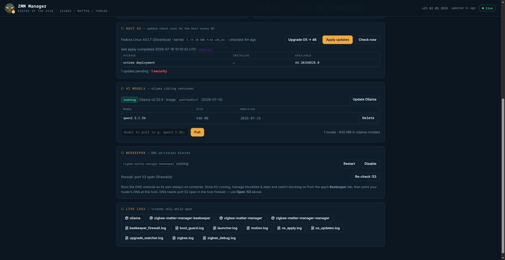
  <br><em>Host OS updates, Ollama model management, and Beekeeper's container and firewall controls</em>
</p>

<p align="center">
  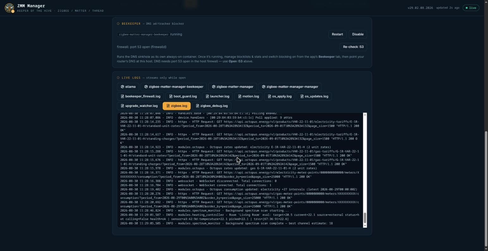
  <br><em>Live logs — file and container streams over SSE, opened on demand and closed when you navigate away</em>
</p>

**Auth.** Reads are open; **actions require a bearer token** from `data/state/manager_token` on the host, which the app surfaces in its Upgrade tab. Because reads are unauthenticated, treat `:8001` as LAN-only and do not expose it through the tunnel.

See **[docs/upgrades.md](docs/upgrades.md)**.

---

## 🌐 Web Interface

Access at **http://YOUR_IP:8000**. All tabs update in real time over the WebSocket. The separate [ZMM Manager](#-zmm-manager-the-sidecar) surface lives on `:8001`.

| Tab | Description |
|:---|:---|
| **Devices** | Main device table — LQI, status, last seen, OTA and protocol badges, chambers, per-device modal |
| **Groups** | Create and control native Zigbee groups |
| **Frames** | Auto-generated dashboards laid out by chamber or device type |
| **Media** | Players, OpenZone sync groups, EQ, radio / Tidal / therapy sources, lyrics |
| **Automations** | All rules across all devices, with the AI builder, filtering, inline edit and trace log |
| **Heating** | EPC rating, thermal profiles, radiator sizing, circuit/room controller, 24h history, efficiency tips |
| **Energy** | Octopus consumption, tariffs, Agile rates and live Home Mini demand |
| **Beekeeper** | DNS sinkhole dashboard — query volume, block rate, live log, top domains and clients |
| **Drive** | Journeys, Drivers, Fuel, Price History and Apiary |
| **Zones** | RSSI-based presence detection zones |
| **Topology** | Mesh visualisation, connection table and packet statistics |
| **MQTT Explorer** | Real-time MQTT traffic monitor and publish tool |
| **Debug** | Live logs, Signal Inspector and raw packet analyser |
| **System Overview** | Host vitals, 1h history and telemetry database size/retention |
| **Settings** | Nine-panel settings surface — see below |
| **Editor** | In-app code editor with test, backup and rollback |
| **Docs** | The bundled `docs/*.md` rendered as an in-app wiki |

### Settings

| Panel | Description |
|:---|:---|
| **Configuration** | Zigbee Radio, MQTT, Home Assistant, Web (incl. HTTPS/SSL), OTA and Backup — form-based, writes `config.yaml`, no manual YAML required |
| **Notifications** | Alert rules, web-push subscriptions and delivery preferences |
| **API** | External integrations — Weather (Open-Meteo, free, no key), Octopus Energy, Fuel Finder credentials |
| **Audio** | Media players, OpenZone groups, chirp calibration and the Sync Lab |
| **Network** | Thread border router, Spectrum Analysis and Zigbee Security credentials (PAN ID, Extended PAN ID, network key, with per-field regenerate) |
| **User Accounts** | My Account, admin user/group/token management, and per-user presence settings |
| **Remote Access** | Managed Cloudflare Tunnel — token and quick modes |
| **AI** | Host capability assessment, local Ollama/SGLang management, and provider configuration |
| **Upgrade** | Application upgrade, host OS updates, Python dependencies and Rust components |

<p align="center">
  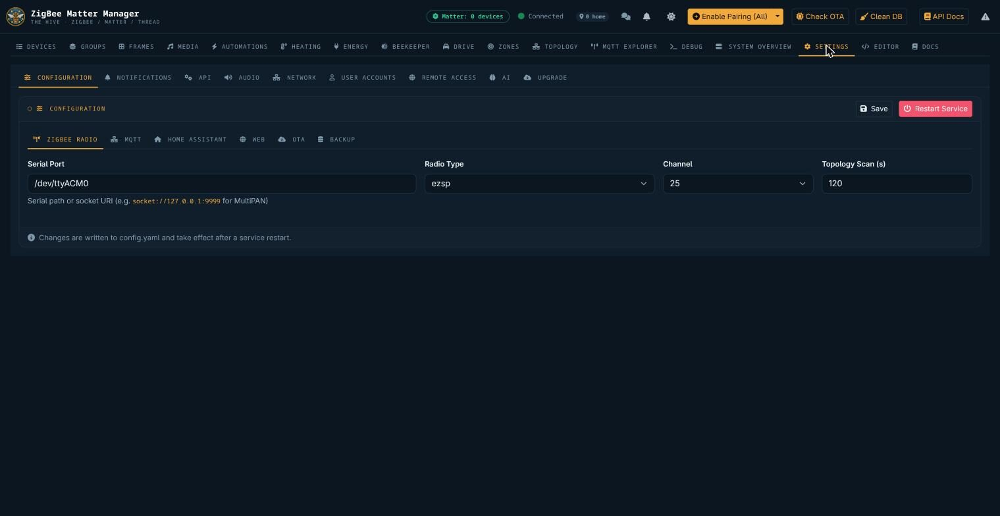
  <br><em>Settings — structured forms over <code>config.yaml</code>, grouped by concern, with a raw YAML escape hatch</em>
</p>

### Device Modal

| Tab | What it does |
|:---|:---|
| **Overview** | Identity, maintenance (re-interview, poll, remove, ban, pair, export config), live readings, per-device config |
| **Control** | Send commands — on/off, brightness, colour picker, thermostat setpoints, cover position |
| **History** | Per-device attribute history from the telemetry store |
| **OTA** | Firmware — check, notify, install, live progress |
| **Binding** | View and manage ZCL bindings between devices |
| **Clusters** | Raw cluster browser — read attributes, explore endpoints |
| **Automation** | Per-device rule builder |
| **Profile** | Discover / Signals / Assemble — live signal capture and device profile authoring |
| **Settings** | MQTT QoS, polling, reporting intervals and device-specific behaviour |

<p align="center">
  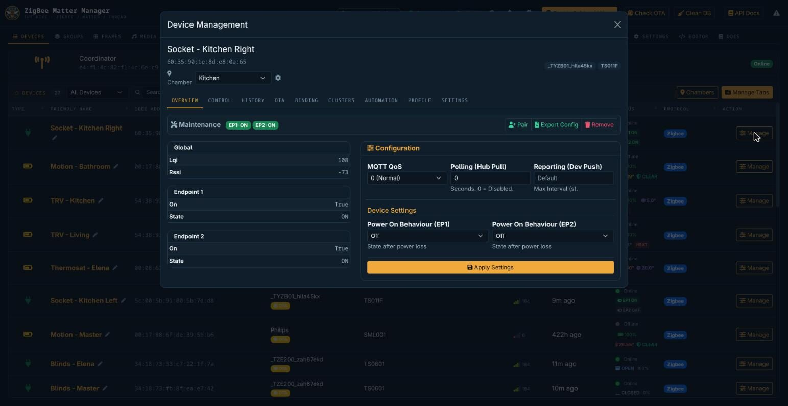
  <br><em>Device modal — identity and chamber, per-endpoint state, and the reporting/polling configuration that actually governs traffic</em>
</p>

<p align="center">
  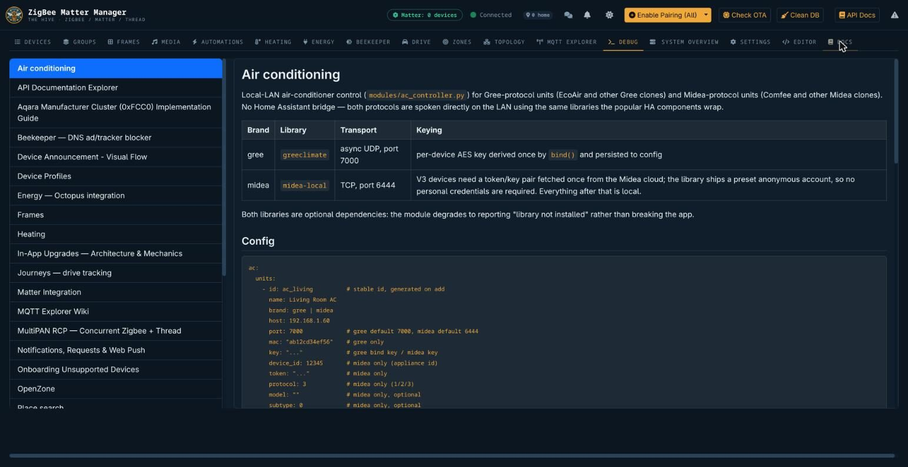
  <br><em>Docs — the shipped documentation rendered in-app, so the hub explains itself without a network round trip</em>
</p>

---

## 🏗️ Architecture

| Component | Technology | Role |
|:---|:---|:---|
| **Core** | Python (FastAPI, zigpy/bellows) | Zigbee radio, device lifecycle, resilience, state |
| **Matter Server** | python-matter-server (managed subprocess) | CHIP SDK controller for Matter devices |
| **Matter Bridge** | aiohttp WebSocket client | Translates Matter nodes into the unified device format |
| **MQTT Service** | aiomqtt | Broker connection, reconnection, HA MQTT Discovery |
| **Cluster Handlers** | `handlers/` | ZCL decoding, normalised state, device-specific logic |
| **Device Profiles** | `modules/device_profiles.py` | Protocol-agnostic device modelling for Zigbee + Matter |
| **Automation Engine** | `modules/automation.py` | State-machine rules, recursive sequences, direct zigpy execution |
| **NL / AI Automations** | `modules/nl_automations.py`, `ai_automations.py` | Deterministic parser first, LLM fallback |
| **Heating** | `heating_advisor.py`, `heating_controller.py`, `thermal_profile.py`, `solar_gain.py`, `radiator_sizing.py` | Modelling and active multi-zone control |
| **Energy** | `modules/octopus.py` | Smart-meter consumption, tariffs, Home Mini demand |
| **Media** | `modules/media/` + `zmm_eq` (Rust) | Players, OpenZone sync, server-side EQ, TTS, therapy synth |
| **Journeys & Fuel** | `modules/journeys.py`, `modules/fuel/` | Trip segmentation, driving behaviour, regional fuel providers |
| **Beekeeper** | sidecar process + `modules/adblock.py` | DNS sinkhole and its loopback control bridge |
| **Presence** | `presence_users.py`, `places.py`, `zones.py` | People, shared geofences, RSSI room occupancy |
| **Auth** | `auth.py`, `auth_mfa.py`, `auth_network.py` | Users, groups, scopes, tokens, TOTP, LAN classification |
| **Telemetry** | `modules/telemetry_db.py` (DuckDB) | Time-series metrics, packet stats, device states, spectrum |
| **MultiPAN** | `modules/tdm/zmm_cpc/` (Rust), `pty_bridge.py`, `multipan.py` | CPC/HDLC framing, PTY↔TCP relay, concurrent Zigbee + Thread |
| **Upgrade Manager** | `modules/upgrade_manager.py` + `/opt/zmm/` | Tag polling, blue-green build/swap with health-check rollback |
| **ZMM Manager** | `manager/` (FastAPI on `:8001`) | Always-on sidecar: watchdog, container control, rollback, host OS, log streaming, disaster recovery |
| **Editor Safety** | `test_recovery.py`, `safe_deploy.py`, `live_edits.py`, `boot_guard.py` | Batch rollback, health-gated deploy, boot-time revert |
| **Frontend** | HTML, Bootstrap 5, ECharts, D3.js | SPA over WebSocket for real-time updates |

For the full file structure see **[docs/structure.md](docs/structure.md)**.

---

## ⚙️ Configuration

Configuration is managed through the **Settings** tab, which provides structured forms backed by `config.yaml`. Direct editing is available via the raw-YAML escape hatch or on disk.

`config/config.yaml` top-level blocks:

| Block | What it configures |
|:---|:---|
| `database` | Zigbee device database path |
| `location` | Where the hub is — country, subdivision and coordinates; drives region-specific data sources |
| `weather` | Open-Meteo poll interval and optional MQTT publish (coordinate fallback for `location`) |
| `media` | Players, Cast/OpenZone sync, EQ, TTS |
| `heating` | Circuits, rooms, TRVs, external sensors, controller behaviour |
| `mqtt` | Broker connection, base topic, discovery prefix |
| `logging` | Levels and debug capture |
| `web` | Host, port, SSL |
| `ota` | Enable flag and image providers |
| `security` | Smart-lock providers (Nuki bridge and Matter) |
| `matter` | Enable flag and python-matter-server port |
| `beekeeper` | DNS sinkhole control endpoint and blocklists |
| `ai` | Provider, model, base URL, temperature, max tokens |
| `zigbee` | Serial port, radio type, channel, PAN ID, network key |
| `fuel` | Fuel Finder base URL and refresh interval (credentials live in `secrets.yaml`) |

```yaml
zigbee:
  port: /dev/ttyACM0          # Serial port, or socket://host:port for MultiPAN
  baudrate: 115200
  channel: 25                  # Auto-selected via spectrum analysis or manual
  pan_id: "0x1A2B"            # Auto-generated on first boot
  extended_pan_id: "..."       # Auto-generated on first boot
  network_key: [...]           # Auto-generated on first boot (16 bytes)

mqtt:
  host: 192.168.1.x
  port: 1883
  username: mqtt_user
  password: mqtt_pass
  base_topic: zmm
  discovery_prefix: homeassistant

# Where this hub is. Used to pick region-specific data sources — currently the
# fuel price feed, which differs by country and, in Australia, by state.
location:
  country: ""       # ISO-3166 alpha-2; blank means Settings offers a suggestion
  subdivision: ""   # e.g. NSW — only for countries with per-state schemes
  latitude:         # blank falls back to weather.latitude / weather.longitude
  longitude:

matter:
  enabled: false
  port: 5580

ai:
  provider: ollama             # openai | ollama | anthropic | custom
  model: qwen2.5:1.5b
  base_url: http://127.0.0.1:11434/v1
  temperature: 0.3
  max_tokens: 2000
```

> **Secrets never live in `config.yaml`** — it is tracked in git. Fuel Finder,
> Octopus and provider credentials go in `config/secrets.yaml` (gitignored) or
> the environment. The Settings UI writes them there, with write-only fields
> that never read a stored secret back to the browser.

> **Audio for speaker-sync calibration.** The chirp calibration records a test
> tone through a microphone, so it needs a capture device inside the container.
> `build.sh` passes the host's `/dev/snd` through automatically and bakes the
> PortAudio runtime into the image. Because podman maps devices at container
> **create** time, a USB mic plugged in *after* the container is running needs a
> container restart to appear. List what the container can see with
> `sudo podman exec zigbee-matter-manager arecord -l`, then set
> `media.cast.sync.mic_device` to a substring of the one you want.

---

## 🗺 Roadmap

### Multi-region fuel prices

The fuel subsystem was written UK-first and the assumption reached every layer:
`E10/E5/B7/SDV` grade codes, a GBP-shaped pence-detection heuristic,
`postcodes.io` for geocoding, a history table with no region column, and `p` /
`Price/L (p)` hardcoded in the Drive tab and the Android Auto screen. Outside the
UK the Drive tab is simply empty.

The work makes the region a **setting**: you pick your country, and fuel lookups,
history and the car screen run against that region's own data source, in its
currency, grades and volume unit.

**Landed so far**

- `modules/fuel/` package with a `FuelProvider` ABC and two reusable bases — `BulkSnapshotProvider` (fetch the country, filter locally with haversine) and `RadiusQueryProvider` (ask per location, behind a coordinate-bucketed cache and a minimum-interval limiter)
- Both UK sources ported onto it as ordinary providers, plus a region registry and `GET /api/fuel/regions`, `GET`/`POST /api/fuel/region`
- The `location:` config block, with coordinate fallback to `weather.*` so existing installs keep working unedited
- A units block (`currency`, `symbol`, `volume`, `display_scale`, `decimals`) and `station_level` on the API responses
- The price-history schema rekeyed to `(region, site_id, fuel, feed_day)` with a `currency` column — because numeric site IDs from France, Spain, Italy and Germany would otherwise collide, and a median across mixed currencies is not a number that means anything
- Geocoding moved off `postcodes.io` onto the hub's own multi-country `Geocoder`, whose per-country postal datasets accept the French and German postcodes the old two-to-eight-alphanumeric validation rejected
- The Drive tab de-hardcoded: grades, attribution and an `Intl.NumberFormat` price formatter all come from the API's units block rather than assuming pence

**Still to come**

| Region | Source | Mode | Auth |
|---|---|---|---|
| 🇬🇧 GB | Fuel Finder, then retailer feeds | bulk | OAuth client credentials | 
| 🇩🇪 DE | Tankerkönig | radius, ≤25 km | free UUID key (1 req/min, CC BY 4.0) |
| 🇫🇷 FR | data.economie.gouv.fr *flux instantané v2* | bulk | none |
| 🇪🇸 ES | MINETUR EstacionesTerrestres | bulk | none |
| 🇮🇹 IT | MIMIT Osservaprezzi | bulk | none |
| 🇦🇺 AU-NSW | FuelCheck v2 | radius | OAuth + apikey |
| 🇦🇺 AU-QLD | QLD Fuel Price Reporting | bulk | free key |
| 🇦🇺 AU-WA | FuelWatch | bulk | none (next-day prices) |
| 🇺🇸 US | EIA petroleum prices | **area average** | free key |

🇬🇧 GB is the only region registered today; the rest are adapters against the
existing contract.

The **United States is modelled honestly**: there is no free station-level US
price feed, and the EIA API publishes weekly state and regional averages only.
The US provider therefore reports `station_level: False` and the UI shows a
single "average in your area" card instead of a station table. Inventing
stations from an average would be worse than showing the average.

The remaining client work is the **Android Auto screen**, which still hardcodes
pence and the four UK grades (`FuelScreen.kt`, `Prefs.kt`). It can land after the
adapters, because the `postcode` query parameter is kept as an alias for `q` —
so the shipped app keeps working throughout.

Full plan, including the verification gates: **[docs/plans/fuel_prices_region.md](docs/plans/fuel_prices_region.md)**.

### Driver attribution

Hub-side attribution shipped first. Car Bluetooth address and Android Auto
signals are the agreed next tier.

---

## 🔧 Troubleshooting

### Debugging Workflow

0. **If the app itself is down or unreachable**, go to the [ZMM Manager](#-zmm-manager-the-sidecar) on `:8001` — container states, log streams and recovery all work with the app container dead
1. **Alert Center** — check the bell first; errors are surfaced as alerts rather than left in the log
2. **Live Logs** — real-time WebSocket log stream with level and IEEE filtering
3. **Signal Inspector** — see every raw signal a device emits, with no device-class assumptions
4. **Debug Packets** — raw ZCL frame capture with decoded summaries
5. **MQTT Explorer** — monitor all MQTT traffic, publish test messages
6. **Trace Log** — automation evaluation history with colour-coded results
7. **Mesh Topology** — connection table and packet statistics
8. **Spectrum Analysis** — identify channel interference causing instability

### Log Files

| File | Content |
|:---|:---|
| `logs/zigbee.log` | Main application log |
| `logs/zigbee_debug.log` | Detailed packet/handler events (when debug enabled) |

### Service Commands

```bash
sudo systemctl status zigbee-matter-manager             # Check service status
sudo systemctl kill -s SIGKILL zigbee-matter-manager    # Kill the service
sudo systemctl start zigbee-matter-manager              # Start the service
sudo journalctl -u zigbee-matter-manager -f             # Follow system logs
sudo tail -f /opt/zigbee_matter_manager/logs/zigbee.log # Follow app logs
```

### Coordinator / USB device not detected

If the setup wizard shows **"No serial ports detected"** or auto-detect finds no
adapter even though `lsusb` and `/dev/ttyACM0` show it on the host, the device
almost certainly isn't passed through to the container. podman maps `--device`
entries at container **create** time, so a coordinator plugged in after the
container was built never reaches it.

```bash
# Confirm the host sees it
lsusb; ls -l /dev/serial/by-id /dev/ttyACM* /dev/ttyUSB* 2>/dev/null

# Recreate the container with the coordinator plugged in (image is cached, so
# this skips the long build and just re-passes the devices)
curl -fsSL https://raw.githubusercontent.com/oneofthemany/ZigBee-Matter-Manager/main/build.sh | sudo bash
```

`build.sh` passes through **every** `/dev/ttyACM*` / `/dev/ttyUSB*` present at
start (plus `/dev/serial` for stable by-id names), so any recognised coordinator
is picked up automatically once it's present when the container is created. The
same plug-in-then-recreate rule applies to a USB microphone for speaker-sync.

### Upgrade Issues

Check the **[ZMM Manager](#-zmm-manager-the-sidecar)** at `https://YOUR_IP:8001` first — it shows the upgrade state, the app's health, every retained image with a Roll back button, and the live `upgrade_watcher.log` stream, all without needing the app to be running. The commands below are the SSH fallback.

```bash
# Check the upgrade watcher status
systemctl status zmm-upgrade.path zmm-upgrade.service

# View the build / swap log
tail -100 ~/.zigbee-matter-manager/data/upgrade/build.log
tail -100 ~/.zigbee-matter-manager/logs/upgrade_watcher.log

# Clear a stale lock if the UI shows "Another upgrade in progress" but nothing is
ps aux | grep -E "podman build|upgrade.sh" | grep -v grep   # Verify nothing is running
rm -f ~/.zigbee-matter-manager/data/upgrade/lock            # Then clear

# Reset failed systemd state after repeated build attempts
sudo systemctl reset-failed zmm-upgrade.path zmm-upgrade.service

# Manually trigger a rollback if the UI is unreachable
sudo podman stop zigbee-matter-manager
sudo podman rm zigbee-matter-manager
sudo podman start zigbee-matter-manager-previous
sudo podman rename zigbee-matter-manager-previous zigbee-matter-manager
```

The UI also exposes a **Dismiss** button on failed-state banners and a
**Force-clear lock** option when a 409 is returned, so most issues can be
resolved without SSH.

### Telemetry database

Almost all DuckDB repair happens **without you doing anything** — damage is
detected, latched and rebuilt. If you have hit a genuinely stuck state, see
**[docs/telemetry_database.md](docs/telemetry_database.md)** before deleting
anything: an oversized `.wal` is usually a migration artifact rather than crash
damage.

---

## 📚 Documentation

The full set is also browsable in-app under the **Docs** tab.

| Document | Description |
|:---|:---|
| [docs/structure.md](docs/structure.md) | Full project file structure |
| [docs/matter.md](docs/matter.md) | Matter integration — setup, supported features, architecture |
| [docs/multipan.md](docs/multipan.md) | MultiPAN — MG24 firmware, CPC wire format, OTBR setup |
| [docs/device-profiles.md](docs/device-profiles.md) | Unified Zigbee + Matter device modelling framework |
| [docs/onboarding.md](docs/onboarding.md) | Developer guide — handler architecture, adding device support |
| [docs/onboarding_unsupported_devices.md](docs/onboarding_unsupported_devices.md) | User guide — visual attribute mapping |
| [docs/aqara_cluster_guide.md](docs/aqara_cluster_guide.md) | Aqara `0xFCC0` cluster implementation reference |
| [docs/automations.md](docs/automations.md) | Automation engine — rule syntax, conditions, sequences, NL parser |
| [docs/heating.md](docs/heating.md) | Heating — advisor, controller, thermal profile, radiator sizing, solar gain |
| [docs/energy.md](docs/energy.md) | Octopus integration — consumption, tariffs, Home Mini |
| [docs/speaker_sync.md](docs/speaker_sync.md) | Media, OpenZone groups, EQ, TTS and the Sync Lab |
| [docs/open-zone.md](docs/open-zone.md) | Source-side clock discipline for multi-room audio |
| [docs/frames.md](docs/frames.md) | Frames and chambers — auto-generated dashboards |
| [docs/journeys.md](docs/journeys.md) | Drive tracking, trips, driving behaviour and fuel |
| [docs/plans/fuel_prices_region.md](docs/plans/fuel_prices_region.md) | Multi-region fuel prices — the full plan |
| [docs/beekeeper.md](docs/beekeeper.md) | Beekeeper — the built-in DNS ad/tracker blocker |
| [docs/presence_detection.md](docs/presence_detection.md) | Presence — users, places and RSSI zones |
| [docs/place-search.md](docs/place-search.md) | Local-first postcode and town lookup |
| [docs/security.md](docs/security.md) | MFA, lockout, LAN-only accounts, smart locks, tile proxy |
| [docs/auth.md](docs/auth.md) | Users, groups, scopes and tokens |
| [docs/remote_access.md](docs/remote_access.md) | Managed Cloudflare Tunnel |
| [docs/notifications.md](docs/notifications.md) | Notifications, requests, messages and web push |
| [docs/air-conditioning.md](docs/air-conditioning.md) | Gree and Midea local-LAN AC control |
| [docs/telemetry_database.md](docs/telemetry_database.md) | DuckDB stores — resilience, repair and recovery |
| [docs/upgrades.md](docs/upgrades.md) | In-app upgrades, editor safety and local LLM containers |
| [docs/mqtt-explorer.md](docs/mqtt-explorer.md) | MQTT Explorer — usage, filtering, architecture |
| [docs/debugging.md](docs/debugging.md) | Packet capture, signal inspector, packet flow, alerts |
| [docs/api_docs.md](docs/api_docs.md) | The in-app API explorer |
| [android/README.md](android/README.md) | Android companion app — channels, scopes, cert pinning |

---

## 🤝 Contributing

Contributions are welcome. The codebase follows a modular handler architecture — adding support for a new device typically means adding or extending a cluster handler in `handlers/`, or authoring a **Device Profile** with no code at all. For a new fuel region, the provider contract in `modules/fuel/base.py` is the seam; see the [roadmap](#-roadmap). See **[docs/onboarding.md](docs/onboarding.md)** for the developer guide.

---

## 📄 License

This project is licensed under the GNU General Public License v3.0. See [LICENSE](LICENSE) for details. Third-party components and their licences are listed in [THIRD_PARTY_NOTICES.md](THIRD_PARTY_NOTICES.md).
