# ZigBee Manager — Automation Engine

## Overview

The automation engine provides state-machine-based triggers with recursive action sequences, executing directly at the ZigBee gateway level with zero MQTT delay. Rules evaluate device attribute changes in real time and fire ordered sequences of commands, delays, waits, gates, branching logic, and parallel execution.

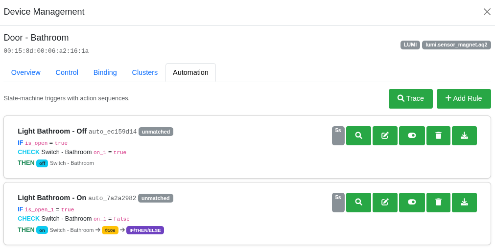

---

## Core Concepts

### State Machine

Rules track **matched/unmatched** state and only fire on transitions — not on every matching update.

| Previous State    | New State | Action                  |
|-------------------|-----------|-------------------------|
| unmatched         | matched   | Run **THEN** sequence   |
| matched           | unmatched | Run **ELSE** sequence   |
| matched           | matched   | Nothing (still matched) |
| unmatched         | unmatched | Nothing                 |
| init (first eval) | matched   | Run **THEN**            |
| init (first eval) | unmatched | Nothing                 |

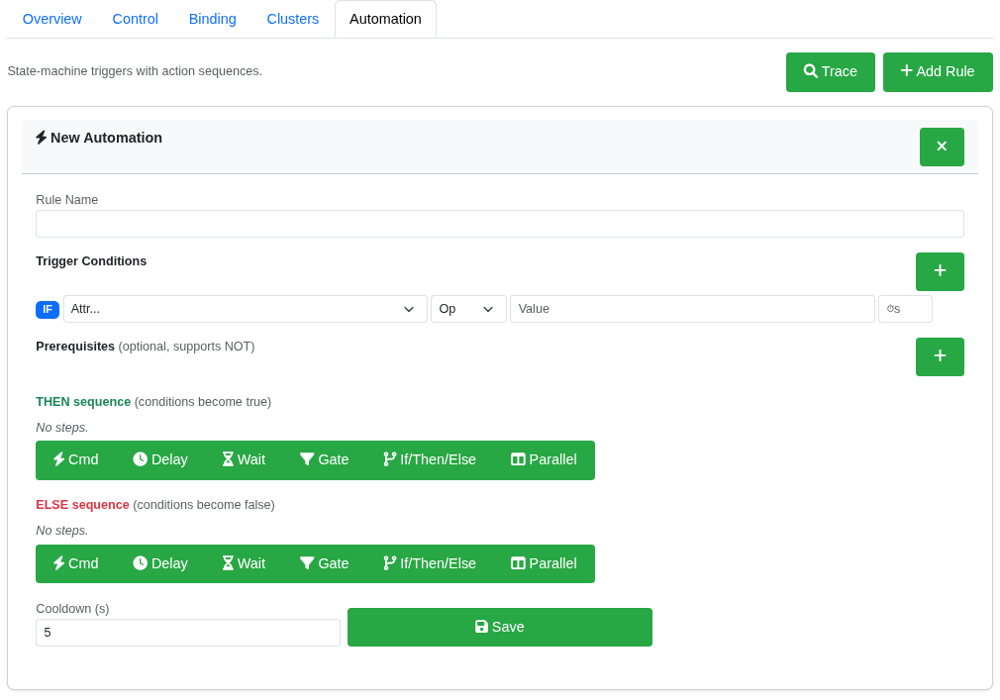

### Rule Structure

Every automation rule consists of four parts:

1. **Trigger Conditions** — attribute checks on the source device (AND logic, up to 5)
2. **Prerequisites** — optional state checks on other devices before firing (supports NOT)
3. **THEN Sequence** — action steps when conditions become true
4. **ELSE Sequence** — action steps when conditions become false

---

## Creating a Rule

Click **Add Rule** on the Automation tab to open the rule builder.

### Step 1: Trigger Conditions

Conditions evaluate attributes on the source device. Multiple conditions are combined with AND logic. Each condition specifies an attribute, operator, and threshold value.

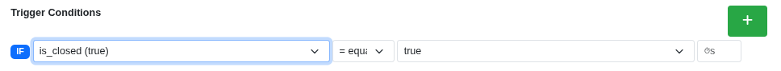

**Supported Operators:**

| Symbol | Meaning |
|---|---|
| `=` | equals |
| `≠` | not equal |
| `>` `<` `>=` `<=` | numeric comparisons |
| `∈` | in list (comma-separated) |
| `∉` | not in list |

**Sustain** — optional hold timer (seconds). The condition must remain true for the specified duration before triggering.

### Step 2: Prerequisites (Optional)

Prerequisites check the current state of **other devices** before the rule fires. These support a **NOT** flag to negate the check.

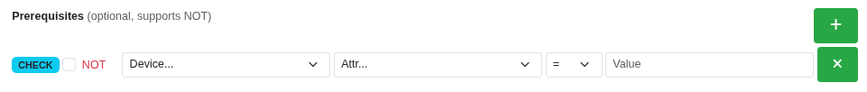

Example: Only fire if the hallway light is currently OFF.

### Step 3: THEN Sequence

Action steps that execute when conditions transition from unmatched → matched.

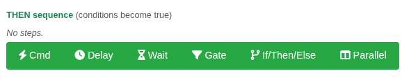

### Step 4: ELSE Sequence

Action steps that execute when conditions transition from matched → unmatched.

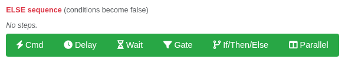

---

## Step Types

### Command

Sends a ZigBee command to a target device. Select the target, command, and optional value. Endpoint is auto-detected.

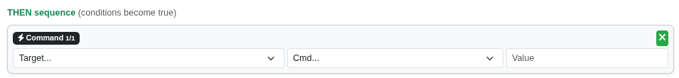

### Delay

Pauses the sequence for a specified number of seconds.

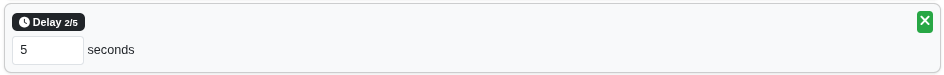

### Wait For

Pauses until a device attribute matches a condition, with a configurable timeout. If the timeout expires, the sequence stops.

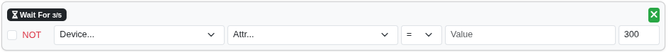

### Gate

An inline condition check that stops the sequence if the condition is false. Supports NOT for negation.

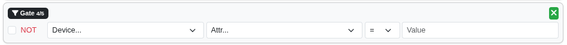

### If / Then / Else (Branching)

Evaluates one or more inline conditions and branches into nested THEN or ELSE paths. When a single condition is used, the AND/OR selector is hidden for a clean simple IF. Adding a second condition reveals the AND/OR logic toggle.

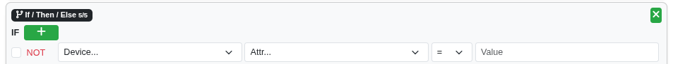

Each inline condition supports NOT negation, device selection, attribute, operator, and value — identical to prerequisites but evaluated inline during sequence execution.

### Parallel

Executes two or more branches concurrently. All branches run simultaneously and the step completes when all branches finish.

Additional branches can be added with the **+ Branch** button.

---

## Rule Card Display

Each saved rule displays as a card showing conditions, prerequisites, sequence summaries, and state.

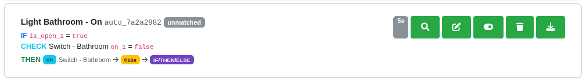

**State Badges:**

| Badge | Meaning |
|---|---|
| `matched` (green) | Conditions currently true |
| `unmatched` (grey) | Conditions currently false |
| `init` (dark) | Not yet evaluated |
| `⏳` (yellow) | Sequence currently running |

**Action Buttons:**

| Button | Action |
|---|---|
| 🔍 | Open trace log filtered to this rule |
| ✏️ | Edit the rule |
| ⏻ | Enable / disable |
| 🗑️ | Delete the rule |
| ⬇️ | Download rule as JSON |

---

## JSON Export

Each rule can be downloaded as a JSON file via the download button on the rule card. The exported file contains the complete rule definition including conditions, prerequisites, and both sequences — useful for backup, sharing, or importing into another instance.

---

## Trace Log

The trace log shows real-time evaluation history for debugging automation behaviour. Open it via the **Trace** button.

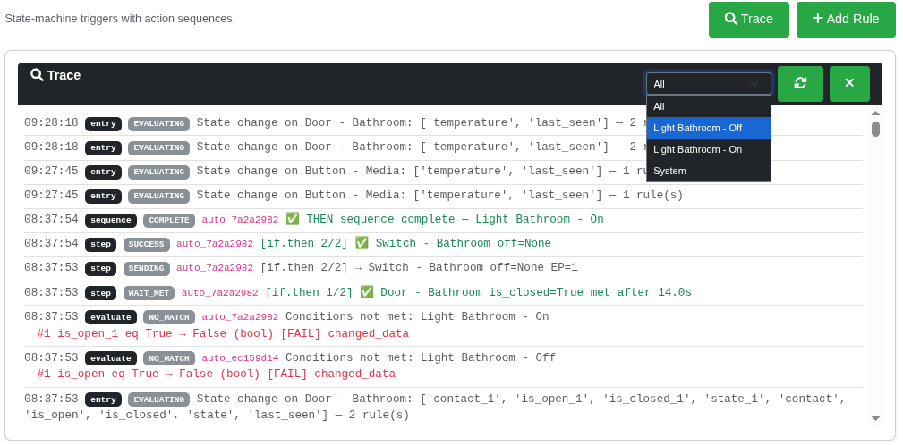

**Result Colours:**

| Colour | Results |
|---|---|
| Green | SUCCESS, FIRING, COMPLETE, WAIT_MET, GATE_PASS, IF_TRUE, PARALLEL_DONE |
| Red | FAIL, ERROR, EXCEPTION, MISSING, CMD_FAIL |
| Yellow | BLOCKED, SUSTAIN_WAIT, DELAY, WAITING |
| Blue | CANCELLED, WAIT_TIMEOUT, IF_FALSE |

Filter by a specific rule using the dropdown, or select **System** to see engine-level events.

---

## Example: Door Contact Light

A practical example — turn on a light when a door opens in low light, turn it off 5 seconds after the door closes.

**Conditions:**
- IF `contact` = `open`
- AND `illuminance` < `11`

**THEN:**
- ⚡ Command → Hall Light → ON

**ELSE:**
- ⏱ Delay → 5 seconds
- ⚡ Command → Hall Light → OFF

---

## Example: Branching with If/Then/Else

A more advanced example using inline branching — when motion is detected, check time of day and set appropriate brightness.

**Conditions:**
- IF `occupancy` = `true`

**THEN:**
- If/Then/Else:
    - IF Kitchen Light `brightness` < `50`
        - THEN: ⚡ Kitchen Light → brightness = 255
        - ELSE: ⚡ Kitchen Light → brightness = 128

---

## Tips

- **Cooldown** prevents rapid re-firing. Set it based on how quickly your sensor re-triggers (motion sensors: 5-10s, contact sensors: 1-2s).
- **Prerequisites** let you create context-aware rules without duplicating conditions across multiple rules.
- **Gates** are useful mid-sequence to bail out if conditions have changed since the sequence started.
- **Wait For** is ideal for confirming a command took effect before proceeding.
- **Parallel** lets you command multiple devices simultaneously rather than sequentially.
- **JSON export** is your backup safety net — download rules before making major changes.