# ZigBee Manager — Automation Engine

## Overview

The automation engine provides state-machine-based triggers with recursive action sequences, executing directly at the ZigBee gateway level with zero MQTT delay. Rules evaluate device attribute changes in real time and fire ordered sequences of commands, delays, waits, gates, branching logic, and parallel execution.

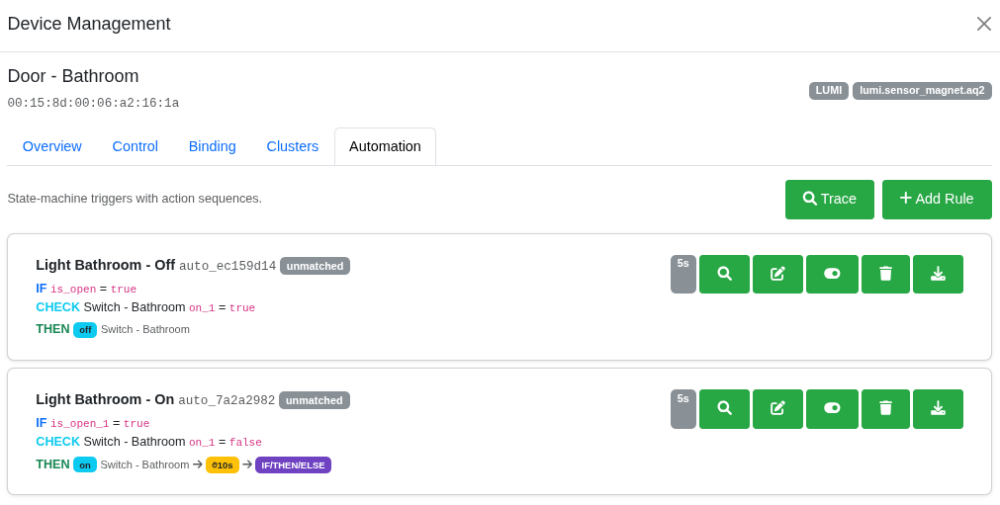

---

## Core Concepts

### State Machine

Rules track **matched/unmatched** state and only fire on transitions — not on every matching update.

| Previous State    | New State | Action                  |
|-------------------|-----------|-------------------------|
| unmatched         | matched   | Run **THEN** sequence   |
| matched           | unmatched | Run **ELSE** sequence   |
| matched           | matched   | Nothing (still matched) |
| unmatched         | unmatched | Nothing                 |
| init (first eval) | matched   | Run **THEN**            |
| init (first eval) | unmatched | Nothing                 |

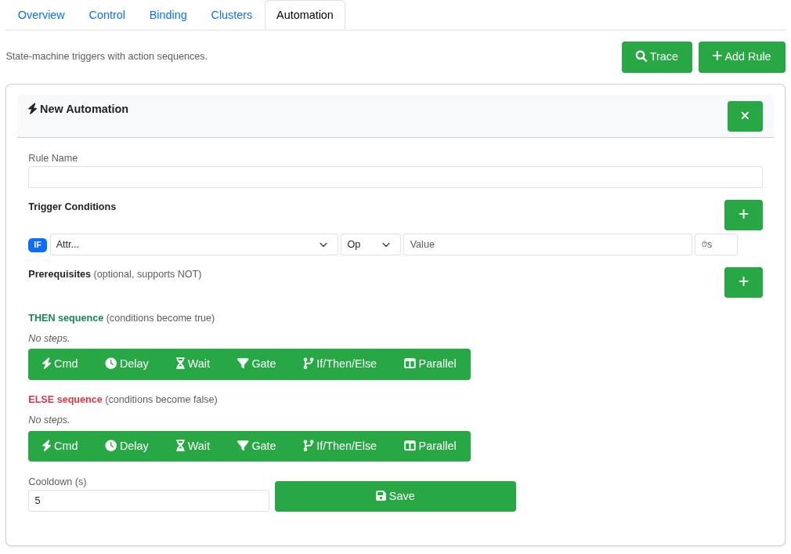

### Rule Structure

Every automation rule consists of four parts:

1. **Trigger Conditions** — attribute checks on the source device (AND or OR logic, up to 5)
2. **Prerequisites** — optional state checks on other devices before firing (supports NOT)
3. **THEN Sequence** — action steps when conditions become true
4. **ELSE Sequence** — action steps when conditions become false

---

## Creating a Rule

Click **Add Rule** on the Automation tab to open the rule builder.

### Step 1: Trigger Conditions

Conditions evaluate attributes on the source device. Each condition specifies an attribute, operator, and threshold value.

**Match ALL (AND) / Match ANY (OR)** — the selector beside the **+** button controls how multiple conditions combine. It appears once a second condition is added; with one condition there is nothing to combine.

- **Match ALL (AND)** — every condition must hold. The default, and how all rules saved before this option existed continue to behave.
- **Match ANY (OR)** — one condition being true is enough. Use it for "either / or" triggers, e.g. a presence user whose `place` is `sky_slough` **or** `sky_osterley` — a single rule covering both sites instead of two near-identical rules.

The joiner badge on each row (`AND` amber / `OR` purple) reflects the current choice, so a glance at the rule tells you which way it reads.

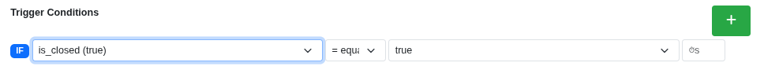

**Supported Operators:**

| Symbol            | Meaning                   |
|-------------------|---------------------------|
| `=`               | equals                    |
| `≠`               | not equal                 |
| `>` `<` `>=` `<=` | numeric comparisons       |
| `∈`               | in list (comma-separated) |
| `∉`               | not in list               |

**Sustain** — optional hold timer (seconds). The condition must remain true for the specified duration before triggering.

#### Condition types

| Type          | Triggers on                                                        |
|---------------|--------------------------------------------------------------------|
| **Attr**      | An attribute on the source device meeting a comparison             |
| **Alarm**     | A clock time on chosen days                                        |
| **Time/Day**  | Being inside a time window on chosen days                          |
| **Sun**       | Being between two sun/clock boundaries (tracks the seasons)        |
| **Zone**      | A person entering or leaving a place — offered for presence users  |

#### Zone: arriving and leaving

Pick **Enters** or **Leaves**, then tick the places the crossing is about.

- **Any place** — every arrival at, or departure from, any named place (or home).
- **One place** — just that one.
- **Several places** — they form a *single* zone. "Work" spanning two offices fires
  once on arriving at either and once on leaving both; driving between the two is
  movement *inside* the zone, so it triggers nothing. This is what you want for a
  person with more than one site, and it's why ticking two places is not the same
  as two OR'd conditions (those would fire on the hop between them).

A zone condition is **edge-triggered**: the crossing is the trigger. That has two
consequences worth knowing:

- The rule only runs its **THEN** sequence. "Not arriving right now" is not the
  same as leaving, so the ELSE sequence is never run — build the opposite crossing
  as a second rule with **Leaves**.
- The trigger re-arms after each crossing, so arriving tomorrow fires it again.

Leaving somewhere for "away" counts as a departure from that place; "away" and
"unknown" are the *absence* of a place, so they can't themselves be entered or left.

After a hub restart the engine restores where each person was, so the first
crossing after a restart is still reported correctly.

### Step 2: Prerequisites (Optional)

Prerequisites check the current state of **other devices** before the rule fires. These support a **NOT** flag to negate the check.

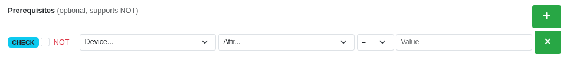

Example: Only fire if the hallway light is currently OFF.

### Step 3: THEN Sequence

Action steps that execute when conditions transition from unmatched → matched.

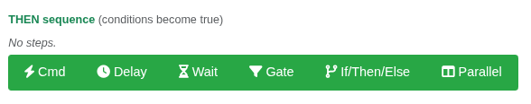

### Step 4: ELSE Sequence

Action steps that execute when conditions transition from matched → unmatched.

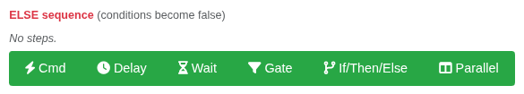

---

## Step Types

### Command

Sends a ZigBee command to a target device. Select the target, command, and optional value. Endpoint is auto-detected.

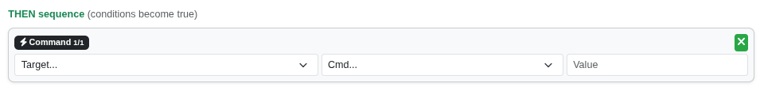

### Delay

Pauses the sequence for a specified number of seconds.

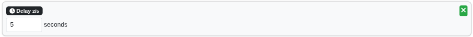

### Wait For

Pauses until a device attribute matches a condition, with a configurable timeout. If the timeout expires, the sequence stops.

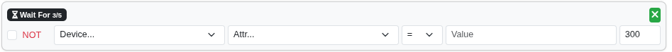

### Gate

An inline condition check that stops the sequence if the condition is false. Supports NOT for negation.

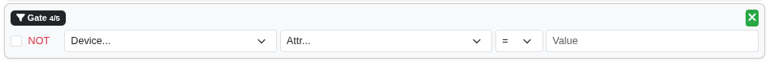

### If / Then / Else (Branching)

Evaluates one or more inline conditions and branches into nested THEN or ELSE paths. When a single condition is used, the AND/OR selector is hidden for a clean simple IF. Adding a second condition reveals the AND/OR logic toggle.

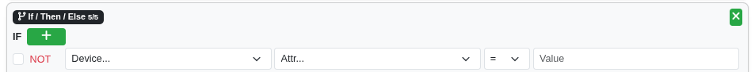

Each inline condition supports NOT negation, device selection, attribute, operator, and value — identical to prerequisites but evaluated inline during sequence execution.

### Parallel

Executes two or more branches concurrently. All branches run simultaneously and the step completes when all branches finish.

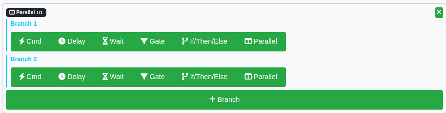

Additional branches can be added with the **+ Branch** button.

---

## Rule Card Display

Each saved rule displays as a card showing conditions, prerequisites, sequence summaries, and state.

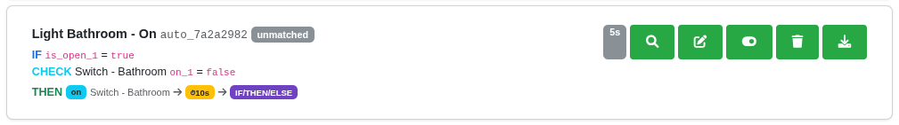

**State Badges:**

| Badge               | Meaning                     |
|---------------------|-----------------------------|
| `matched` (green)   | Conditions currently true   |
| `unmatched` (grey)  | Conditions currently false  |
| `init` (dark)       | Not yet evaluated           |
| `⏳` (yellow)        | Sequence currently running  |

**Action Buttons:**

| Button | Action                               |
|--------|--------------------------------------|
| 🔍     | Open trace log filtered to this rule |
| ✏️     | Edit the rule                        |
| ⏻      | Enable / disable                     |
| 🗑️    | Delete the rule                      |
| ⬇️     | Download rule as JSON                |

---

## JSON Export

Each rule can be downloaded as a JSON file via the download button on the rule card. The exported file contains the complete rule definition including conditions, prerequisites, and both sequences — useful for backup, sharing, or importing into another instance.

---

## Trace Log

The trace log shows real-time evaluation history for debugging automation behaviour. Open it via the **Trace** button.

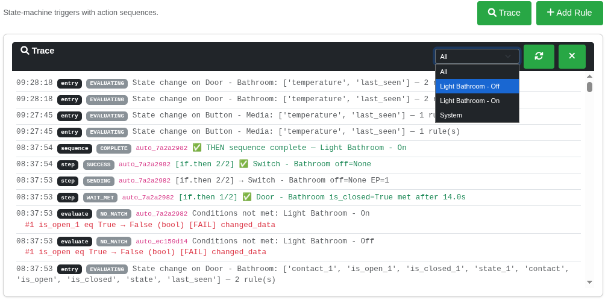

**Result Colours:**

| Colour  | Results                                                                  |
|---------|--------------------------------------------------------------------------|
| Green   | SUCCESS, FIRING, COMPLETE, WAIT_MET, GATE_PASS, IF_TRUE, PARALLEL_DONE   |
| Red     | FAIL, ERROR, EXCEPTION, MISSING, CMD_FAIL                                |
| Yellow  | BLOCKED, SUSTAIN_WAIT, DELAY, WAITING                                    |
| Blue    | CANCELLED, WAIT_TIMEOUT, IF_FALSE                                        |

Filter by a specific rule using the dropdown, or select **System** to see engine-level events.

---

## Example: Door Contact Light

A practical example — turn on a light when a door opens in low light, turn it off 5 seconds after the door closes.

**Conditions:**
- IF `contact` = `open`
- AND `illuminance` < `11`

**THEN:**
- ⚡ Command → Hall Light → ON

**ELSE:**
- ⏱ Delay → 5 seconds
- ⚡ Command → Hall Light → OFF

---

## Example: One Rule for Two Work Sites (OR)

A presence user who works at either of two offices. With **Match ANY (OR)** a single
rule covers both, rather than one rule per site.

**Conditions** (Match ANY):
- IF `place` = `sky_slough`
- OR `place` = `sky_osterley`

**THEN:**
- 💬 Message → set "at work"

**ELSE:** fires when the user is at neither site — i.e. on leaving work.

---

## Example: Arriving At and Leaving Work

The same two offices as a **zone**, which is usually the better shape: it separates
arriving from leaving into two rules that each do one thing, and it ignores the
drive between the two sites.

**Rule 1 — arriving**

- Source: the presence user
- IF **Zone** → **Enters** → ☑ Slough ☑ Osterley
- THEN: 💬 Message "at work" → ⚡ Turn off Hall Light

**Rule 2 — leaving**

- Source: the presence user
- IF **Zone** → **Leaves** → ☑ Slough ☑ Osterley
- THEN: ⚡ Heating → on

Neither rule needs an ELSE. Driving from Slough to Osterley fires nothing, because
both sites are the same zone.

---

## Example: Branching with If/Then/Else

A more advanced example using inline branching — when motion is detected, check time of day and set appropriate brightness.

**Conditions:**
- IF `occupancy` = `true`

**THEN:**
- If/Then/Else:
    - IF Kitchen Light `brightness` < `50`
        - THEN: ⚡ Kitchen Light → brightness = 255
        - ELSE: ⚡ Kitchen Light → brightness = 128

---

## Tips

- **Cooldown** prevents rapid re-firing. Set it based on how quickly your sensor re-triggers (motion sensors: 5-10s, contact sensors: 1-2s).
- **Prerequisites** let you create context-aware rules without duplicating conditions across multiple rules.
- **Zone** beats a `place` equality check whenever you care about the *moment* someone arrives or leaves rather than where they currently are — and it's the only way to act on a departure without an ELSE.
- **Match ANY (OR)** collapses "one rule per value" duplicates into a single rule — and the ELSE sequence then means "none of them are true", which is usually what you want for a leaving/away action.
- **Gates** are useful mid-sequence to bail out if conditions have changed since the sequence started.
- **Wait For** is ideal for confirming a command took effect before proceeding.
- **Parallel** lets you command multiple devices simultaneously rather than sequentially.
- **JSON export** is your backup safety net — download rules before making major changes.